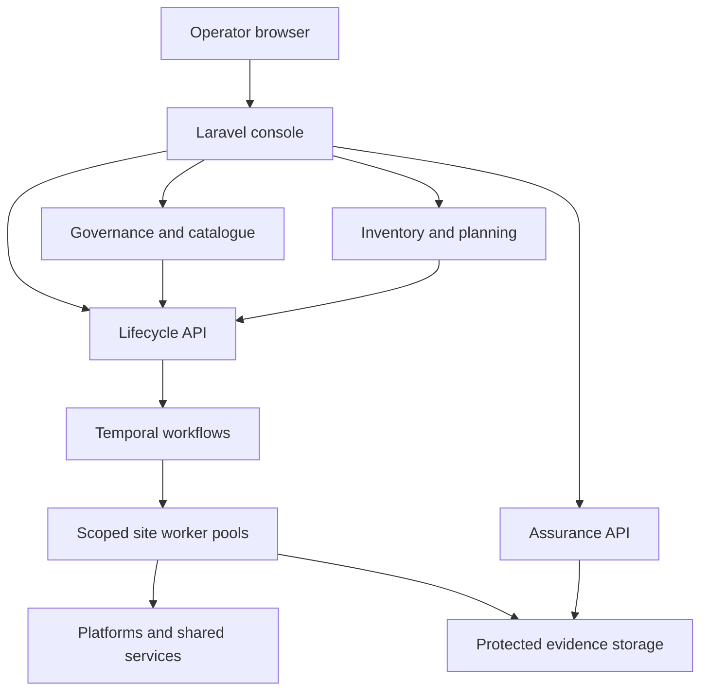

# Greenfield target architecture

Status: proposed enterprise baseline; implementation decisions close in P00.

This document defines a fresh product architecture for portable application hosting and workload mobility. The previous implementation supplies requirements, infrastructure knowledge and useful failure cases. It is not a runtime dependency, compatibility layer or foundation to refactor. The abandoned `greenfield/laravel-product-foundation` branch is not the delivery branch for this plan.

The attached source establishes Laravel/PHP business services, a Laravel/Inertia/Vue console, Python infrastructure services, durable workflows, explicit data ownership and independently deployable containers. This document resolves those ideas into a proposed baseline. Choices not expressly required by the source remain proposals until their P00 decisions are recorded.

Implementation order, deliverables and acceptance gates are in [the phased implementation plan](../implementation/phased-plan.md).

## 1. Architectural objectives and boundaries

- Model an application as a set of workloads, dependencies and desired outcomes spanning environments and workload security domains.
- Keep requested intent, observed infrastructure, reviewed plans, authorization, workflow progress and evidence distinct.
- Provide one accountable owner for each decision, mutable record and native-resource mutation.
- Support independently deployable services without splitting every capability into a separate microservice.
- Execute long operations through durable workflows and scoped workers near approved infrastructure endpoints.
- Publish platform support only when qualification evidence exists for the relevant operation and conditions.
- Preserve infrastructure security and recovery constraints even though the software starts from an empty product tree.
- Keep the first usable release narrow enough to qualify one complete application path.

The first proposed native path provisions a selected Linux workload on OpenStack, then qualifies one VMware-to-OpenStack migration method. P00 confirms the platform versions, guest profile, data method, application acceptance checks and native test environments. Broader platform coverage follows separate qualification campaigns.

## 2. Logical topology

Arrows show logical dependencies rather than a complete firewall policy. Event distribution, observability and identity are cross-cutting facilities. The production network flow register must identify endpoints, protocols, initiating direction, credentials and allowed scopes for every connection.

## 3. Bounded contexts and deployable services

| Repository location | Proposed implementation | Authoritative responsibility |
| --- | --- | --- |
| `apps/console/` | Laravel, Inertia, Vue, TypeScript | Browser sessions, task-oriented navigation, page composition and presentation preferences |
| `services/governance/` | Laravel/PHP | Tenants, membership, delegated grants, approval records, revocations and separation of duties |
| `services/catalogue/` | Laravel/PHP | Applications, workload definitions, dependencies, security-domain associations and immutable intent revisions |
| `services/inventory/` | Python | Endpoint registration, observed resources, discovery provenance, freshness and normalized identities |
| `services/planning/` | Python | Requirements, capability/profile versions, assessments, placement decisions and immutable plans |
| `services/lifecycle/` | Python with Temporal | Admission, job identity, workflow commands, operation ledger, fencing and reconciliation |
| `services/assurance/` | Laravel/PHP | Evidence metadata, custody policy, qualification decisions, acceptance records and supported-capability publications |
| `workers/` | Separately deployed Python pools | Scoped discovery, infrastructure, guest, shared-service and data-movement activities |

Laravel assurance is a proposed baseline drawn from the latest source architecture. Earlier suggestions of Python assurance are superseded for planning purposes; P00 confirms language ownership before scaffolding. Authentication is federated to an identity provider; governance owns application authorization rather than a new password directory.

Workers belong to the context whose activities they execute. Discovery pools implement inventory collection. Privileged execution pools operate under lifecycle authority and its operation ledger. Separate deployment does not create a second owner of approvals, jobs or native-operation state.

Shared-service adapters implement capabilities such as DNS allocation, IP address reservation, backup enrolment and monitoring registration. They run within approved workflow activities. There is no catchall integrations service with independent business authority.

## 4. Product model

| Entity | Owner | Meaning and essential relationships |
| --- | --- | --- |
| Tenant | Governance | Administrative and authorization boundary with memberships and delegated scopes |
| Environment | Catalogue | Named product deployment context associated with a tenant; not automatically a network boundary |
| Application | Catalogue | Business grouping of workloads, declared dependencies and acceptance requirements |
| Workload | Catalogue | Deployable component with resource, guest, data and security requirements |
| WorkloadSecurityDomain (WSD) | Catalogue | Grouping by service ownership, lifecycle and security/recovery requirements; distinct from tenant and application |
| SecurityDomain | Catalogue | Logical zone class and security authority; defines intended zone membership and boundary requirements |
| DomainInstance | Inventory (observation), lifecycle (managed binding) | Site/platform realization of a logical domain; inventory observes the native identity, while lifecycle owns the managed resource binding and mutation journal |
| IntentRevision | Catalogue | Immutable requested configuration with parent revision, actor and canonical digest |
| Site / Endpoint | Inventory | Registered location and collection/execution target; configuration is distinguished from observations |
| Observation | Inventory | Timestamped, sourced statement about native state, with freshness and completeness information |
| Capability / ProfileVersion | Planning | Versioned operation support, constraints, requirements and relevant qualification references |
| Assessment | Planning | Explained eligibility or gaps against pinned intent, observations, requirements and policy versions |
| Plan | Planning | Immutable executable proposal binding scope, actions, preconditions, risks and input versions |
| Approval / Revocation | Governance | Authenticated governance decision bound to an exact plan digest and authorized scope |
| Job / Admission | Lifecycle | Stable operation identity and record of successful or denied admission checks |
| NativeOperation | Lifecycle | Durable side-effect record with idempotency identity, fencing and observed outcome |
| Evidence / Qualification | Assurance | Protected artifacts, provenance and claims of support under explicitly recorded conditions |

An application may span multiple WSDs and security domains. A security domain is not inferred solely from a tenant, application name or environment. A ZIP is an interface between zones, never a workload zone. Catalogue owns the requested relationships; observed DomainInstance records and lifecycle-managed bindings are different record types with one writer each. P00 resolves WSD cardinality, permitted associations and inheritance rules through concrete examples and schema invariants.

Identifiers are stable and opaque. Every tenant-owned record contains an explicit tenant binding. Cross-context references use identifiers and versions rather than foreign keys crossing service databases. Deletion rules preserve records needed for active jobs, accountability and retained evidence.

## 5. Data ownership and consistency

- Each service owns its writes, database migrations and domain rules. Other services use its API or published events.
- Proposed initial deployment uses one PostgreSQL database per context on an appropriately operated cluster. Isolated schemas with distinct roles are an alternative requiring an ADR.
- Service credentials cannot write another context's tables. The console has no direct access to business-service databases.
- Local read projections are disposable derivatives with provenance and lag indicators; they do not become competing authorities.
- Catalogue owns desired intent. Inventory owns observations. Platform systems remain authoritative for actual native resources.
- Planning owns immutable plans. Governance owns approval decisions. Lifecycle owns admission and native-operation records.
- Temporal owns durable workflow history and resumption. Lifecycle job views are controlled projections, not a competing workflow state machine.
- Assurance owns evidence metadata and qualification decisions; protected object storage holds the artifact bytes.
- Terraform owns its declared resource fields and locked state. API and Ansible operations must not silently contend for those fields.
- Cross-service workflows use explicit state transitions and compensations rather than distributed database transactions.

The data dictionary must identify retention, classification, encryption, deletion, export and recovery needs per aggregate. RPO/RTO values are proposed and accepted with service owners in P00; this document does not assert existing targets.

## 6. API and event semantics

Versioned OpenAPI contracts describe HTTP commands and queries. Versioned AsyncAPI or equivalent machine-readable event contracts describe channels, envelopes and message payloads. Generated clients and schema checks prevent independent PHP and Python interpretations.

Every privileged command carries authenticated tenant, actor, service identity, scope and correlation context. Tenant headers and trace metadata are not credentials. Receivers validate issuer, audience, expiry, token scope and the relationship between the principal and requested tenant.

Long-running commands return a stable job identifier and an authorized status URL. The console uses polling initially; live status transport is an optional later decision. Retryable commands accept an idempotency key scoped to tenant, principal and command type. Reusing a key with a different canonical payload is rejected.

Revisioned edits use optimistic concurrency and reject stale revisions. Validation, authorization, conflict, throttling and uncertain-outcome responses have consistent structured error contracts without leaking another tenant's resource existence.

Domain changes and their outbox records commit atomically inside the owning service. Consumers use durable deduplication/inbox records and idempotent handlers. Delivery is treated as at least once; there is no end-to-end exactly-once claim.

Event envelopes include event ID, type, schema version, occurred time, producer, tenant scope, aggregate identity/version, causation and correlation identifiers. Payloads exclude credentials and unnecessary sensitive inventory. Ordering is explicitly scoped, normally to one aggregate; no global order is assumed.

P00 selects message transport, replay/retention policy, dead-letter handling and schema compatibility rules. Temporal is the workflow engine, not an implicit replacement for domain-event transport. Replaying an event must not accidentally replay an authorized native side effect.

## 7. Admission, workflows and execution safety

### Immutable plan and authorization binding

A plan binds its intent revision, inventory snapshot references, capability/profile versions, policy evaluations, adapter versions, action graph, execution scope, expiry and declared recovery strategy. Canonical serialization produces its digest. Updating material inputs produces a new plan and requires a new approval decision.

Approval records identify actor, authority, plan digest, scope, conditions and expiry. Admission rechecks current grants, separation of duties, revocations, input freshness, applicable qualification and required reservations. An event or cached projection alone is insufficient proof of current permission for a privileged boundary.

Qualification has a separate, explicit lab campaign admission policy. It permits testing an unqualified candidate only against approved isolated endpoints, datasets, credentials, operation scopes and campaign limits. All tenant, plan, approval, fencing, evidence and recovery controls still apply. Its output is candidate evidence for independent assurance review, never automatic promotion to supported operation. Ordinary operational admission requires current qualification; a failed lab gate cannot be bypassed by relabeling a production job as a test.

Execution authority is short-lived, audience-bound and restricted to the admitted tenant, operation and resource scope. Workers retrieve secrets just in time through an approved broker or secret store. They never accept browser-provided native credentials as reusable platform-wide authority.

### Durable admission and workflow dispatch

Lifecycle creates admission/job records and a dispatch outbox transactionally. A dispatcher starts the Temporal workflow with a stable workflow identifier and reconciles ambiguous start responses. Duplicate delivery cannot create a second logical job.

Temporal workflows make deterministic coordination decisions. Native API calls, secret retrieval, wall-clock observations and other external effects occur in activities. Worker upgrade/versioning procedures must preserve compatibility with running histories.

Lifecycle owns the authoritative operation ledger even when pools deploy independently. Before dispatching a native mutation, it records the operation identity, plan binding, target, intended change, applicable state owner and fencing scope. Workers report attempts and observations through authenticated lifecycle contracts rather than writing an unrelated local ledger.

### Native side-effect rules

- Distinguish not-started, confirmed-failed, confirmed-succeeded and outcome-unknown states.
- A transport timeout does not establish native failure. Unknown outcomes require observation and reconciliation before retry.
- Persist native request identifiers where supported and use resource-specific idempotency where reliable.
- Acquire durable resource-scoped fencing before mutation; renewing a lease alone does not prove a disconnected old worker has stopped acting.
- Recover expired locks only after establishing an acceptable native state and preventing conflicting writers.
- Revalidate authority at privileged boundaries. Revocation blocks subsequent work; already-dispatched effects must still be observed truthfully.
- Cancellation requests stop at declared safe points. They do not imply that an in-flight mutation was reversed.
- Define point of no return, compensation and operator-assisted recovery for each workflow, especially after migration cutover.
- Confirm postconditions against native observations and application checks before declaring completion.
- Keep workload data on approved source/target paths; do not route payloads through the console or event bus.

## 8. Control plane, site plane and security

The proposed central control plane runs the console and context APIs, workflow infrastructure, databases, evidence services and observability. Kubernetes is the proposed deployment target, subject to P00 validation of operational support and hosting constraints.

Site-local pools connect to explicitly allowed platform and shared-service endpoints. Prefer worker-initiated connections where practical; the topology ADR specifies actual direction and firewall requirements. Central placement is acceptable only when reachability, latency and security controls are demonstrated.

| Pool | Credential and network boundary |
| --- | --- |
| Discovery | Read-only native access and bounded collection budgets |
| Infrastructure | Approved compute, storage and network mutations for admitted scope |
| Guest | Authorized guest configuration operations and scoped OS credentials |
| Shared services | Adapter-specific DNS, IPAM, backup, identity or monitoring permissions |
| Data movement | Approved datasets, transfer endpoints, encryption and bandwidth limits |

Use workload identity, authenticated service channels, distinct service accounts, scoped secret access, encrypted persistent storage and audited privileged actions. Apply least privilege and deny-by-default network policies, with allowlists derived from the network flow register.

Verify that the chosen Kubernetes network implementation actually enforces the policies and test allowed and denied paths. NetworkPolicy declarations alone do not provide authenticated or encrypted service channels.

Tenant isolation covers API responses, object paths, queries, job/status access, event subscriptions, exports, logs and support tooling. Resource naming is not an access-control mechanism. Break-glass access and support impersonation require explicit design, time bounds and audit evidence.

Worker commissioning verifies site identity, endpoint trust, available capabilities, credential scopes and qualification prerequisites. Disconnection stops new unsafe execution, retains recoverable local observations if required, and exposes a clear disconnected status. Reconnection reconciles ledger and native state before resuming ambiguous work.

## 9. Delivery, observability and recovery

One repository contains independently built and released services. Proposed top-level areas are `apps/`, `services/`, `workers/`, `contracts/`, `packages/`, `deploy/`, `tests/` and `docs/`. Shared packages contain contracts, generated clients and narrow technical utilities, not shared mutable business models.

Each deployable has locked dependencies, a reproducible image, health/readiness signals, migration ownership and an upgrade compatibility policy. CI validates contracts, meaningful domain invariants, container builds, dependency risks and tenant isolation. Release artifacts include image digests and provenance; signing and admission controls are finalized in P00/P01.

OpenTelemetry-compatible correlation ties the browser request to assessments, approval, job, activity and native operation. Logs redact credentials and sensitive payloads. Metrics cover queue age, tenant fairness, discovery freshness, native API throttling, unknown outcomes, workflow stalls, evidence delivery and capacity.

Backups cover service databases, protected artifacts, Temporal persistence and infrastructure state with coordinated recovery procedures. A successful backup job is not a restore test. Recovery exercises establish what happens to queued work, in-flight mutations, approvals, fencing and partially transferred data after restoration.

Database upgrades use compatible expand/contract changes. Running workflows and old/new worker coexistence receive explicit upgrade tests. Platform adapter updates invalidate or rerun affected qualification campaigns when behavior changes.

## 10. Decisions and phased realization

P00 records dependency compatibility, exact versions, identity provider integration, broker, database isolation, object retention, Kubernetes distribution, site connectivity, secrets technology, approved native environments and measurable service objectives. All are explicit decisions rather than implied facts from this architecture.

P01 establishes delivery foundations. P02 delivers governance and P03 the catalogue. P04 adds read-only inventory; P05 adds planning. P06 proves durable workflows and failure semantics using simulation. P07 qualifies native provisioning. P08 qualifies the selected VMware-to-OpenStack migration. P09 expands supported platforms and capability combinations. P10 completes enterprise operational readiness. P11 performs pilot acceptance and general-availability release.

Security, deployability, evidence and recovery begin with the foundations and develop throughout delivery. P10 is a final readiness gate rather than the point where those concerns first appear.

Support publications distinguish planned, implemented, simulator-verified and native-qualified capabilities. Qualification is specific to platform/version, operation, migration direction, method, guest profile and material storage/network/security conditions. One successful migration never establishes blanket support for another direction or method.
