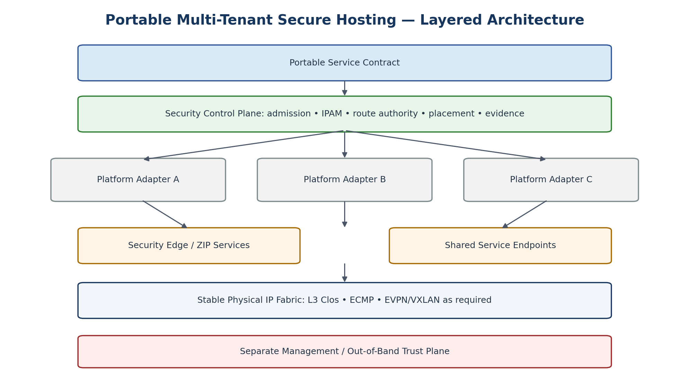

# Executive Summary

[Documentation home](../../README.md) · [Source document](../../../reference/migration-source-documents/Handbook_v1_0.docx) · [Chapter index](README.md)

> **Source:** HB10 — Draft v1.0. Historical source; not the active design.
> This is a source-content transcription, not a new approval or a current platform-validation result.

<!-- source-sha256: 100c760003b9ff956ae369ece65c5ffe7736f6d481496d8df4c99dd6105d4190 -->

> **Historical only.** Use the [v1.4 reference architecture](../../architecture/reference/README.md) for the active design baseline. Conflicting historical text has not been silently reconciled.
<!-- SOURCE-BLOCK HB10:18 BEGIN -->

<!-- SOURCE-BLOCK HB10:18 END -->

<!-- SOURCE-BLOCK HB10:19 BEGIN -->

This handbook defines a portable hosting architecture in which consumers request security and service outcomes rather than vendor-specific network constructs. A consumer specifies a tenant namespace, workload security domain, security profile, zone placement, workload networks, intended flows, shared services, external exposure, and availability requirements. A control plane validates that request, allocates addressing, derives routing, selects an authorized platform, invokes platform-specific Terraform adapters, validates the realized state, and produces evidence.

<!-- SOURCE-BLOCK HB10:19 END -->

<!-- SOURCE-BLOCK HB10:20 BEGIN -->

The architecture intentionally keeps the physical network stable. The physical fabric provides resilient IP transport and, where useful, EVPN/VXLAN transport. Tenant lifecycle, security-domain routing, workload microsegmentation, and most high-cardinality network state remain in the platform overlay. Inter-zone routing occurs through an explicit Zone Interface Point (ZIP) or security edge. A new tenant or workload should not normally require a switch configuration change.

<!-- SOURCE-BLOCK HB10:20 END -->

<!-- SOURCE-BLOCK HB10:21 BEGIN -->

Portability is defined as equivalent semantics and verified security outcomes, not identical topology. A Nutanix VPC, an NSX project/Tier-1 realization, and an OpenStack Neutron routing context can all implement the same portable Security Domain semantics without pretending that their native APIs are identical. Each platform must pass a common conformance suite before it is approved for a given assurance profile.

<!-- SOURCE-BLOCK HB10:21 END -->

<!-- SOURCE-BLOCK HB10:22 BEGIN -->

<!-- SOURCE-BLOCK HB10:22 END -->

<!-- SOURCE-BLOCK HB10:23 BEGIN -->

Figure 1. Layered reference architecture.

<!-- SOURCE-BLOCK HB10:23 END -->

<!-- SOURCE-BLOCK HB10:24 BEGIN -->

| ARCHITECTURE IN ONE SENTENCE The physical fabric carries connectivity; platform overlays create isolated routing domains; security edges enforce trust transitions; the service control plane decides what may exist; and automated tests prove the result. |
| --- |

<!-- SOURCE-BLOCK HB10:24 END -->

<!-- SOURCE-BLOCK HB10:25 BEGIN -->

## Key Outcomes

<!-- SOURCE-BLOCK HB10:25 END -->

<!-- SOURCE-BLOCK HB10:26 BEGIN -->

- Secure-by-default tenancy: no public exposure, Internet egress, cross-tenant reachability, inter-zone reachability, management reachability, or arbitrary routing unless explicitly authorized.

<!-- SOURCE-BLOCK HB10:26 END -->

<!-- SOURCE-BLOCK HB10:27 BEGIN -->

- Government-aligned security zones and explicit ZIP-mediated trust transitions.

<!-- SOURCE-BLOCK HB10:27 END -->

<!-- SOURCE-BLOCK HB10:28 BEGIN -->

- Zero-touch provisioning through a vendor-neutral service contract and platform-specific Terraform adapters.

<!-- SOURCE-BLOCK HB10:28 END -->

<!-- SOURCE-BLOCK HB10:29 BEGIN -->

- Stable physical fabric with little or no per-tenant configuration.

<!-- SOURCE-BLOCK HB10:29 END -->

<!-- SOURCE-BLOCK HB10:30 BEGIN -->

- Portable service semantics across Nutanix, VMware/NSX, OpenStack, bare metal, and future platforms.

<!-- SOURCE-BLOCK HB10:30 END -->

<!-- SOURCE-BLOCK HB10:31 BEGIN -->

- Continuous conformance and evidence instead of treating successful provisioning as proof of security.

<!-- SOURCE-BLOCK HB10:31 END -->

<!-- SOURCE-BLOCK HB10:32 BEGIN -->

- Clear separation between data-path security, management/OOB, platform control, service consumption, and physical transport.

<!-- SOURCE-BLOCK HB10:32 END -->

<!-- SOURCE-BLOCK HB10:33 BEGIN -->

<!-- SOURCE-BLOCK HB10:33 END -->

<!-- SOURCE-BLOCK HB10:35 BEGIN -->

| Part I — Foundations | Part IV — Zero-Touch Automation and Terraform |
| --- | --- |
| 1. Purpose, Scope, and Intended Use | 28. Canonical Hosting API |
| 2. Normative Language and Architectural Invariants | 29. Zero-Touch Provisioning Workflow |
| 3. Security Standards Context | 30. Terraform Architecture |
| 4. Core Conceptual Model | 31. State Boundaries |
| 5. Threat and Trust Model | 32. Policy as Code and Security Admission |
| Part II — Reference Architecture | 33. Secrets and Automation Credentials |
| 6. High-Level Reference Architecture | 34. CI/CD and Change Gates |
| 7. Tenant Namespace | 35. Drift and Reconciliation |
| 8. Workload Security Domain | Part V — Assurance, Testing, and Operations |
| 9. Security Domain Instance | 36. Assurance Profiles |
| 10. Security Zone Semantics | 37. Conformance Test Framework |
| 11. ZIP and Security Edge Architecture | 38. Deployment Evidence |
| 12. Management and Out-of-Band Architecture | 39. Logging, Telemetry, and Observability |
| 13. Physical Fabric | 40. Capacity and Performance Engineering |
| 14. Platform Overlay Architecture | 41. High Availability and Failure Behaviour |
| 15. Routing Architecture and Route Authority | 42. Backup and Restore |
| 16. IP Address Management | 43. Incident Response and Containment |
| 17. IPv6 and Dual-Stack | 44. Change and Exception Management |
| 18. Shared Services and Service Bindings | 45. Lifecycle and Offboarding |
| 19. Public Ingress and Internet Egress | 46. Migration and Transition Connectivity |
| 20. Workload Microsegmentation | Part VI — Governance and Delivery |
| 21. Multi-Site and Disaster-Recovery Network Design | 47. Operating Model and Separation of Duties |
| Part III — Platform Implementation Profiles | 48. Architecture Review Checklist |
| 22. Portability and Platform Conformance | 49. Tenant / WSD Onboarding Checklist |
| 23. Nutanix Implementation Profile | 50. Delivery Roadmap |
| 24. VMware / NSX Implementation Profile | 51. Initial Reference Implementation |
| 25. OpenStack Implementation Profile | 52. Architecture Acceptance Criteria |
| 26. Bare Metal and Future Platforms | Appendices A–I — Object model • Terraform patterns • policy matrix • tests • evidence • ADR • glossary • requirements • references |
| 27. Platform Capability Registry |  |

<!-- SOURCE-BLOCK HB10:35 END -->

<!-- SOURCE-BLOCK HB10:36 BEGIN -->

| NAVIGATION The handbook uses Word heading styles throughout. The Navigation pane can be used for direct section navigation, and a dynamic Word TOC can be generated from Heading levels 1–3 if desired. |
| --- |

<!-- SOURCE-BLOCK HB10:36 END -->

<!-- SOURCE-BLOCK HB10:37 BEGIN -->

<!-- SOURCE-BLOCK HB10:37 END -->

[Previous chapter](01-document-control.md) · [Chapter index](README.md) · [Next chapter](03-part-i-foundations.md)
