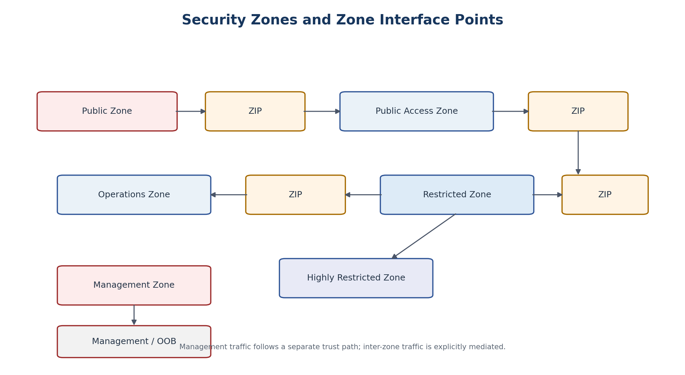

# 10. Security Zone Semantics

[Documentation home](../../README.md) · [Source document](../../../reference/migration-source-documents/Handbook_v1_0.docx) · [Chapter index](README.md)

> **Source:** HB10 — Draft v1.0. Historical source; not the active design.
> This is a source-content transcription, not a new approval or a current platform-validation result.

<!-- source-sha256: 100c760003b9ff956ae369ece65c5ffe7736f6d481496d8df4c99dd6105d4190 -->

> **Historical only.** Use the [v1.4 reference architecture](../../architecture/reference/README.md) for the active design baseline. Conflicting historical text has not been silently reconciled.

Figure 3. Zone classes and explicit ZIP-mediated transitions.

| Zone | Primary Role in This Architecture |
| --- | --- |
| PAZ | Mediates access between public/external networks and internal services; appropriate place for WAF, reverse proxy, gateways and controlled external-facing functions. |
| OZ | Routine operational workload functions and application tiers where the applicable control set allows. |
| RZ | Concentrations of sensitive systems, repositories, critical server/data tiers and services requiring stronger protection. |
| HRZ | Higher-assurance environment when required by categorization/threat/risk. |
| REZ | Controlled extranet/partner interaction where applicable. |
| MZ | Dedicated administration environment separate from business service activity. |
| ZIP | Boundary system between two zones that enforces inter-zone communication policy. |

| INTERPRETATION The zone class describes required trust semantics. The physical or virtual mechanism that realizes it is selected by the implementation profile and assurance requirements. |
| --- |

[Previous chapter](9-security-domain-instance.md) · [Chapter index](README.md) · [Next chapter](11-zip-and-security-edge-architecture.md)
