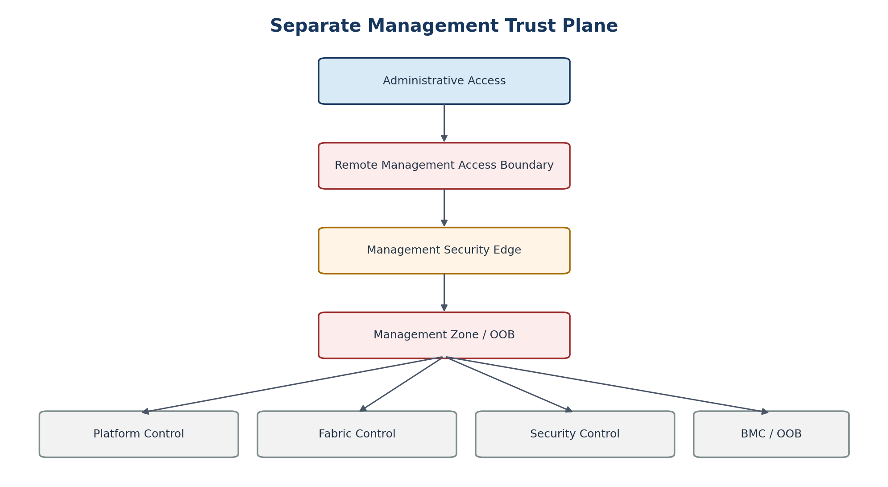

# 12. Management and Out-of-Band Architecture

[Documentation home](../../README.md) · [Source document](../../../reference/migration-source-documents/Handbook_v1_0.docx) · [Chapter index](README.md)

> **Source:** HB10 — Draft v1.0. Historical source; not the active design.
> This is a source-content transcription, not a new approval or a current platform-validation result.

<!-- source-sha256: 100c760003b9ff956ae369ece65c5ffe7736f6d481496d8df4c99dd6105d4190 -->

> **Historical only.** Use the [v1.4 reference architecture](../../architecture/reference/README.md) for the active design baseline. Conflicting historical text has not been silently reconciled.
<!-- SOURCE-BLOCK HB10:125 BEGIN -->

<!-- SOURCE-BLOCK HB10:125 END -->

<!-- SOURCE-BLOCK HB10:126 BEGIN -->

<!-- SOURCE-BLOCK HB10:126 END -->

<!-- SOURCE-BLOCK HB10:127 BEGIN -->

Figure 4. Management trust plane separated from workload data paths.

<!-- SOURCE-BLOCK HB10:127 END -->

<!-- SOURCE-BLOCK HB10:128 BEGIN -->

Management is not a normal workload service. The management plane hosts administration interfaces and control APIs for hypervisors, SDN systems, switches, firewalls/security appliances, BMCs, automation controllers, logging administration and other infrastructure components. Where hardware supports dedicated management interfaces, a physically separate OOB network is the preferred baseline.

<!-- SOURCE-BLOCK HB10:128 END -->

<!-- SOURCE-BLOCK HB10:129 BEGIN -->

| MGT-001 | Tenant workload networks SHALL have no direct route to infrastructure management interfaces. |
| --- | --- |

<!-- SOURCE-BLOCK HB10:129 END -->

<!-- SOURCE-BLOCK HB10:130 BEGIN -->

| MGT-002 | Administrative access SHALL originate from an authorized management access path and traverse management-specific security controls. |
| --- | --- |

<!-- SOURCE-BLOCK HB10:130 END -->

<!-- SOURCE-BLOCK HB10:131 BEGIN -->

| MGT-003 | Automation identities used to manage tenant workloads SHALL be separated from identities able to modify the physical fabric, security edge, or management foundation. |
| --- | --- |

<!-- SOURCE-BLOCK HB10:131 END -->

<!-- SOURCE-BLOCK HB10:132 BEGIN -->

| MGT-004 | Break-glass access SHALL be separately controlled, strongly authenticated, logged, time-bounded where feasible, and periodically tested. |
| --- | --- |

<!-- SOURCE-BLOCK HB10:132 END -->

[Previous chapter](11-zip-and-security-edge-architecture.md) · [Chapter index](README.md) · [Next chapter](13-physical-fabric.md)
