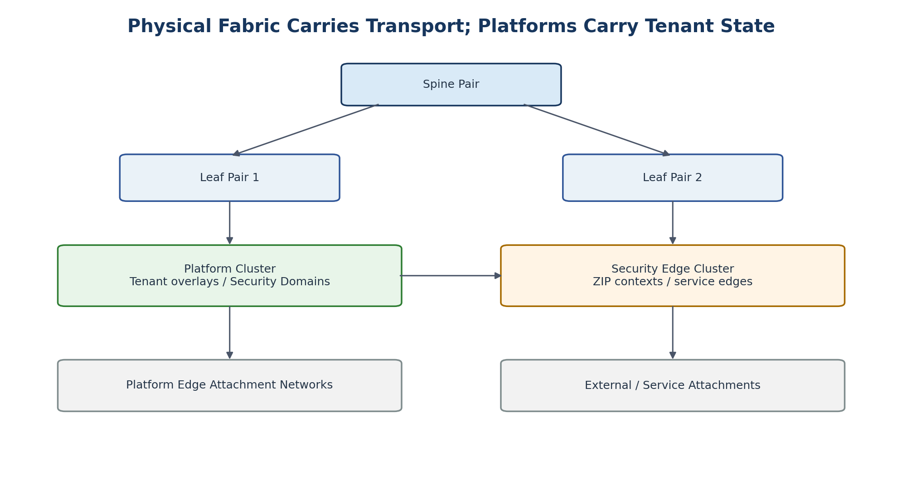

# 13. Physical Fabric

[Documentation home](../../README.md) · [Source document](../../../reference/migration-source-documents/Handbook_v1_0.docx) · [Chapter index](README.md)

> **Source:** HB10 — Draft v1.0. Historical source; not the active design.
> This is a source-content transcription, not a new approval or a current platform-validation result.

<!-- source-sha256: 100c760003b9ff956ae369ece65c5ffe7736f6d481496d8df4c99dd6105d4190 -->

> **Historical only.** Use the [v1.4 reference architecture](../../architecture/reference/README.md) for the active design baseline. Conflicting historical text has not been silently reconciled.
<!-- SOURCE-BLOCK HB10:133 BEGIN -->

<!-- SOURCE-BLOCK HB10:133 END -->

<!-- SOURCE-BLOCK HB10:134 BEGIN -->

<!-- SOURCE-BLOCK HB10:134 END -->

<!-- SOURCE-BLOCK HB10:135 BEGIN -->

Figure 5. Stable physical fabric with platform and security-edge attachments.

<!-- SOURCE-BLOCK HB10:135 END -->

<!-- SOURCE-BLOCK HB10:136 BEGIN -->

The recommended network foundation is a routed L3 Clos fabric using ECMP, with EVPN/VXLAN employed where overlay transport or physical-service attachment requires it. The design goal is to prevent tenant scale from becoming switch-control-plane scale.

<!-- SOURCE-BLOCK HB10:136 END -->

<!-- SOURCE-BLOCK HB10:137 BEGIN -->

| Physical Fabric Responsibility | Default |
| --- | --- |
| Resilient IP underlay | YES |
| ECMP path diversity | YES |
| EVPN/VXLAN transport where required | YES |
| HCI / platform attachment | YES |
| Security-edge attachment | YES |
| Per-tenant application policy | NO |
| Per-WSD firewall policy | NO |
| Routine per-tenant VRF provisioning | NO |
| Workload lifecycle | NO |

<!-- SOURCE-BLOCK HB10:137 END -->

<!-- SOURCE-BLOCK HB10:138 BEGIN -->

| FAB-001 | Normal creation, modification, and deletion of tenants, WSDs, workload networks, and workload security policies SHALL NOT require physical fabric changes. |
| --- | --- |

<!-- SOURCE-BLOCK HB10:138 END -->

<!-- SOURCE-BLOCK HB10:139 BEGIN -->

| FAB-002 | A physical VRF SHALL be created only when the physical fabric itself must provide L3 routing for a legitimate routing/security domain. |
| --- | --- |

<!-- SOURCE-BLOCK HB10:139 END -->

<!-- SOURCE-BLOCK HB10:140 BEGIN -->

| FAB-003 | Function names such as backup, migration, platform, ZIP, or generic transit SHALL NOT by themselves justify a VRF. |
| --- | --- |

<!-- SOURCE-BLOCK HB10:140 END -->

<!-- SOURCE-BLOCK HB10:141 BEGIN -->

## 13.1 Acceptable Reasons for a Physical VRF

<!-- SOURCE-BLOCK HB10:141 END -->

<!-- SOURCE-BLOCK HB10:142 BEGIN -->

- Physical servers or appliances that must route within the same Security Domain Instance.

<!-- SOURCE-BLOCK HB10:142 END -->

<!-- SOURCE-BLOCK HB10:143 BEGIN -->

- A physical external/partner domain that must be kept separate from other routing authorities.

<!-- SOURCE-BLOCK HB10:143 END -->

<!-- SOURCE-BLOCK HB10:144 BEGIN -->

- A dedicated high-assurance domain whose architecture requires physical-fabric routing separation.

<!-- SOURCE-BLOCK HB10:144 END -->

<!-- SOURCE-BLOCK HB10:145 BEGIN -->

- A site/service architecture in which the fabric, rather than a platform overlay, is the authorized L3 realization.

<!-- SOURCE-BLOCK HB10:145 END -->

[Previous chapter](12-management-and-out-of-band-architecture.md) · [Chapter index](README.md) · [Next chapter](14-platform-overlay-architecture.md)
