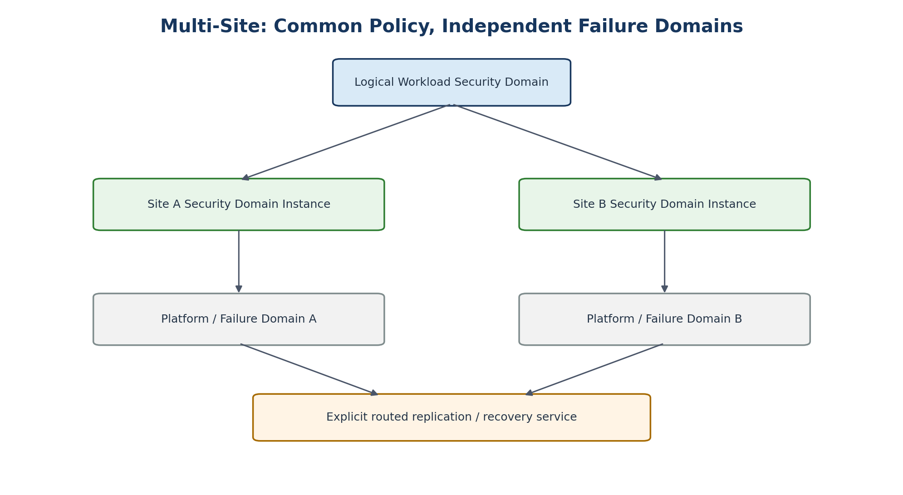

# 21. Multi-Site and Disaster-Recovery Network Design

[Documentation home](../../README.md) · [Source document](../../../reference/migration-source-documents/Handbook_v1_0.docx) · [Chapter index](README.md)

> **Source:** HB10 — Draft v1.0. Historical source; not the active design.
> This is a source-content transcription, not a new approval or a current platform-validation result.

<!-- source-sha256: 100c760003b9ff956ae369ece65c5ffe7736f6d481496d8df4c99dd6105d4190 -->

> **Historical only.** Use the [v1.4 reference architecture](../../architecture/reference/README.md) for the active design baseline. Conflicting historical text has not been silently reconciled.
<!-- SOURCE-BLOCK HB10:184 BEGIN -->

<!-- SOURCE-BLOCK HB10:184 END -->

<!-- SOURCE-BLOCK HB10:185 BEGIN -->

<!-- SOURCE-BLOCK HB10:185 END -->

<!-- SOURCE-BLOCK HB10:186 BEGIN -->

Figure 6. Common logical policy with site-local security and failure domains.

<!-- SOURCE-BLOCK HB10:186 END -->

<!-- SOURCE-BLOCK HB10:187 BEGIN -->

The logical WSD can span multiple sites while each site retains independent Security Domain Instances and failure domains. L2 stretch is not the default. Replication, recovery, application failover and migration should use explicit routed services whose security policy and capacity are independently tested.

<!-- SOURCE-BLOCK HB10:187 END -->

<!-- SOURCE-BLOCK HB10:188 BEGIN -->

| SITE-001 | Security Domain Instances SHOULD be site-local by default. |
| --- | --- |

<!-- SOURCE-BLOCK HB10:188 END -->

<!-- SOURCE-BLOCK HB10:189 BEGIN -->

| SITE-002 | Layer-2 stretch across sites SHALL require a documented application/availability requirement and failure-domain analysis. |
| --- | --- |

<!-- SOURCE-BLOCK HB10:189 END -->

<!-- SOURCE-BLOCK HB10:190 BEGIN -->

| SITE-003 | Recovery-site connectivity SHALL be pre-authorized and tested; emergency recovery SHALL NOT depend on ad hoc route leaking. |
| --- | --- |

<!-- SOURCE-BLOCK HB10:190 END -->

<!-- SOURCE-BLOCK HB10:191 BEGIN -->

<!-- SOURCE-BLOCK HB10:191 END -->

[Previous chapter](20-workload-microsegmentation.md) · [Chapter index](README.md) · [Next chapter](26-part-iii-platform-implementation-profiles.md)
