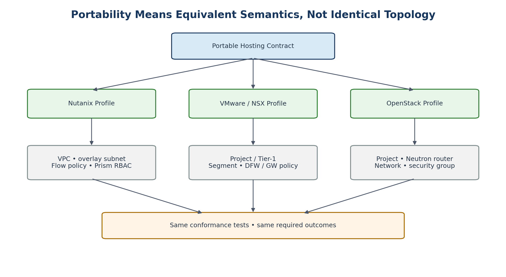

# 22. Portability and Platform Conformance

[Documentation home](../../README.md) · [Source document](../../../reference/migration-source-documents/Handbook_v1_0.docx) · [Chapter index](README.md)

> **Source:** HB10 — Draft v1.0. Historical source; not the active design.
> This is a source-content transcription, not a new approval or a current platform-validation result.

<!-- source-sha256: 100c760003b9ff956ae369ece65c5ffe7736f6d481496d8df4c99dd6105d4190 -->

> **Historical only.** Use the [v1.4 reference architecture](../../architecture/reference/README.md) for the active design baseline. Conflicting historical text has not been silently reconciled.
<!-- SOURCE-BLOCK HB10:193 BEGIN -->

<!-- SOURCE-BLOCK HB10:193 END -->

<!-- SOURCE-BLOCK HB10:194 BEGIN -->

<!-- SOURCE-BLOCK HB10:194 END -->

<!-- SOURCE-BLOCK HB10:195 BEGIN -->

Figure 7. One portable contract, multiple native realizations.

<!-- SOURCE-BLOCK HB10:195 END -->

<!-- SOURCE-BLOCK HB10:196 BEGIN -->

Platform implementations do not need identical topology. They need to satisfy the same portable semantics and pass the same relevant conformance tests. This prevents the architecture from collapsing to the lowest common denominator while still preserving portability at the service layer.

<!-- SOURCE-BLOCK HB10:196 END -->

<!-- SOURCE-BLOCK HB10:197 BEGIN -->

| PORT-001 | Every platform SHALL publish a machine-readable capability profile and a tested implementation profile. |
| --- | --- |

<!-- SOURCE-BLOCK HB10:197 END -->

<!-- SOURCE-BLOCK HB10:198 BEGIN -->

| PORT-002 | A placement decision SHALL fail rather than silently reduce a requested security or availability capability. |
| --- | --- |

<!-- SOURCE-BLOCK HB10:198 END -->

<!-- SOURCE-BLOCK HB10:199 BEGIN -->

| PORT-003 | Platform-specific features MAY be exposed as optional extensions provided the WSD declares the dependency and portability impact. |
| --- | --- |

<!-- SOURCE-BLOCK HB10:199 END -->

[Previous chapter](26-part-iii-platform-implementation-profiles.md) · [Chapter index](README.md) · [Next chapter](23-nutanix-implementation-profile.md)
