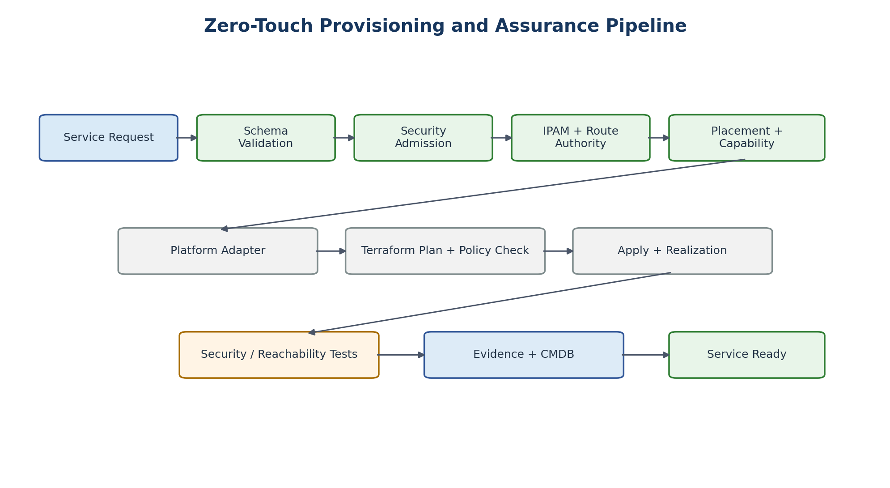

# 29. Zero-Touch Provisioning Workflow

[Documentation home](../../README.md) · [Source document](../../../reference/migration-source-documents/Handbook_v1_0.docx) · [Chapter index](README.md)

> **Source:** HB10 — Draft v1.0. Historical source; not the active design.
> This is a source-content transcription, not a new approval or a current platform-validation result.

<!-- source-sha256: 100c760003b9ff956ae369ece65c5ffe7736f6d481496d8df4c99dd6105d4190 -->

> **Historical only.** Use the [v1.4 reference architecture](../../architecture/reference/README.md) for the active design baseline. Conflicting historical text has not been silently reconciled.
<!-- SOURCE-BLOCK HB10:232 BEGIN -->

<!-- SOURCE-BLOCK HB10:232 END -->

<!-- SOURCE-BLOCK HB10:233 BEGIN -->

<!-- SOURCE-BLOCK HB10:233 END -->

<!-- SOURCE-BLOCK HB10:234 BEGIN -->

Figure 8. Provisioning is complete only after realization, testing, and evidence.

<!-- SOURCE-BLOCK HB10:234 END -->

<!-- SOURCE-BLOCK HB10:235 BEGIN -->

1. Receive a versioned WSD request from a service catalogue or API.

<!-- SOURCE-BLOCK HB10:235 END -->

<!-- SOURCE-BLOCK HB10:236 BEGIN -->

2. Validate schema, naming, ownership, quotas, and lifecycle metadata.

<!-- SOURCE-BLOCK HB10:236 END -->

<!-- SOURCE-BLOCK HB10:237 BEGIN -->

3. Apply security admission rules to zone topology, exposure, required services, and requested flows.

<!-- SOURCE-BLOCK HB10:237 END -->

<!-- SOURCE-BLOCK HB10:238 BEGIN -->

4. Allocate IPv4/IPv6 prefixes and reservations from authoritative IPAM.

<!-- SOURCE-BLOCK HB10:238 END -->

<!-- SOURCE-BLOCK HB10:239 BEGIN -->

5. Compile route intent through the Route Authority.

<!-- SOURCE-BLOCK HB10:239 END -->

<!-- SOURCE-BLOCK HB10:240 BEGIN -->

6. Evaluate platform capabilities, security authorization, site constraints, capacity, lifecycle and availability.

<!-- SOURCE-BLOCK HB10:240 END -->

<!-- SOURCE-BLOCK HB10:241 BEGIN -->

7. Select the platform adapter and construct the Terraform root stack.

<!-- SOURCE-BLOCK HB10:241 END -->

<!-- SOURCE-BLOCK HB10:242 BEGIN -->

8. Run terraform plan and policy-as-code checks; require approval where the change class requires it.

<!-- SOURCE-BLOCK HB10:242 END -->

<!-- SOURCE-BLOCK HB10:243 BEGIN -->

9. Apply using a least-privileged execution identity.

<!-- SOURCE-BLOCK HB10:243 END -->

<!-- SOURCE-BLOCK HB10:244 BEGIN -->

10. Wait for platform realization/readiness rather than treating API acceptance as completion.

<!-- SOURCE-BLOCK HB10:244 END -->

<!-- SOURCE-BLOCK HB10:245 BEGIN -->

11. Run security, route, reachability, logging and negative-path tests.

<!-- SOURCE-BLOCK HB10:245 END -->

<!-- SOURCE-BLOCK HB10:246 BEGIN -->

12. Generate evidence and register the realized service in inventory/CMDB.

<!-- SOURCE-BLOCK HB10:246 END -->

<!-- SOURCE-BLOCK HB10:247 BEGIN -->

13. Mark the WSD Service Ready only when mandatory gates pass.

<!-- SOURCE-BLOCK HB10:247 END -->

<!-- SOURCE-BLOCK HB10:248 BEGIN -->

| AUTO-001 | If security admission, IPAM, route authority, or mandatory policy validation is unavailable, new provisioning SHALL stop rather than inventing or bypassing required state. |
| --- | --- |

<!-- SOURCE-BLOCK HB10:248 END -->

[Previous chapter](28-canonical-hosting-api.md) · [Chapter index](README.md) · [Next chapter](30-terraform-architecture.md)
