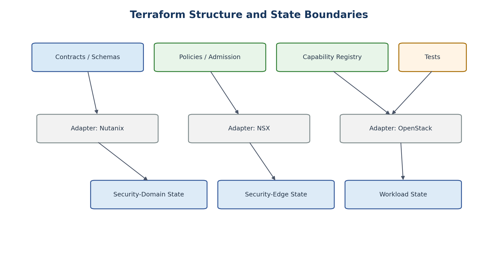

# 30. Terraform Architecture

[Documentation home](../../README.md) · [Source document](../../../reference/migration-source-documents/Handbook_v1_0.docx) · [Chapter index](README.md)

> **Source:** HB10 — Draft v1.0. Historical source; not the active design.
> This is a source-content transcription, not a new approval or a current platform-validation result.

<!-- source-sha256: 100c760003b9ff956ae369ece65c5ffe7736f6d481496d8df4c99dd6105d4190 -->

> **Historical only.** Use the [v1.4 reference architecture](../../architecture/reference/README.md) for the active design baseline. Conflicting historical text has not been silently reconciled.
<!-- SOURCE-BLOCK HB10:249 BEGIN -->

<!-- SOURCE-BLOCK HB10:249 END -->

<!-- SOURCE-BLOCK HB10:250 BEGIN -->

<!-- SOURCE-BLOCK HB10:250 END -->

<!-- SOURCE-BLOCK HB10:251 BEGIN -->

Figure 9. Separate contracts, adapters, tests, and state boundaries.

<!-- SOURCE-BLOCK HB10:251 END -->

<!-- SOURCE-BLOCK HB10:252 BEGIN -->

Terraform is an actuator, not the service API or placement engine. Provider configurations belong in root modules and are passed to reusable child modules. Child modules declare provider requirements but should remain focused on one platform/problem domain.

<!-- SOURCE-BLOCK HB10:252 END -->

<!-- SOURCE-BLOCK HB10:253 BEGIN -->

| repository/   contracts/     wsd/     security-domain/     flow/     service-binding/     exposure/   policy/     admission/     routing/     assurance/   adapters/     nutanix/     nsx/     openstack/   modules/     &lt;provider-native reusable units&gt;   stacks/     foundation/     security-edge/     security-domains/     workloads/   tests/     contract/     routing/     security/     conformance/   evidence/  |
| --- |

<!-- SOURCE-BLOCK HB10:253 END -->

<!-- SOURCE-BLOCK HB10:254 BEGIN -->

| TF-001 | Provider configuration SHALL be defined in root modules and passed to child modules; reusable child modules SHOULD NOT embed provider credentials/configuration. |
| --- | --- |

<!-- SOURCE-BLOCK HB10:254 END -->

<!-- SOURCE-BLOCK HB10:255 BEGIN -->

| TF-002 | Provider versions SHALL be constrained and dependency lock files SHALL be committed and reviewed. |
| --- | --- |

<!-- SOURCE-BLOCK HB10:255 END -->

<!-- SOURCE-BLOCK HB10:256 BEGIN -->

| TF-003 | The orchestration layer SHALL select the provider adapter; a single giant conditional module SHOULD NOT attempt to implement all platforms. |
| --- | --- |

<!-- SOURCE-BLOCK HB10:256 END -->

<!-- SOURCE-BLOCK HB10:257 BEGIN -->

| TF-004 | Module interfaces SHOULD be relatively flat and composable; deeply nested modules that obscure lifecycle or ownership boundaries SHOULD be avoided. |
| --- | --- |

<!-- SOURCE-BLOCK HB10:257 END -->

[Previous chapter](29-zero-touch-provisioning-workflow.md) · [Chapter index](README.md) · [Next chapter](31-state-boundaries.md)
