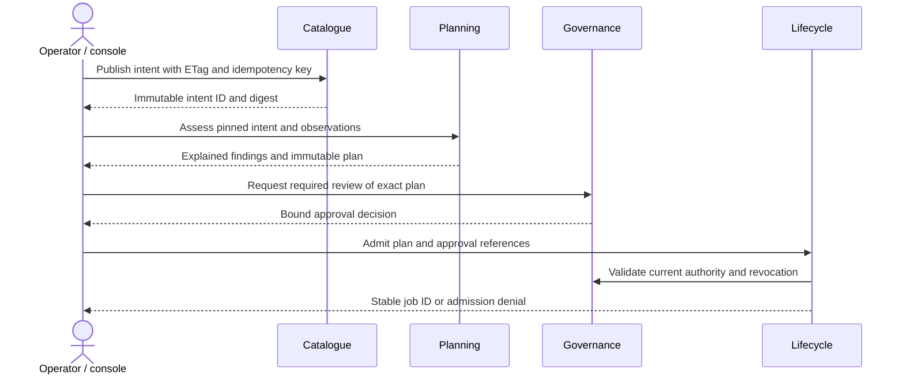
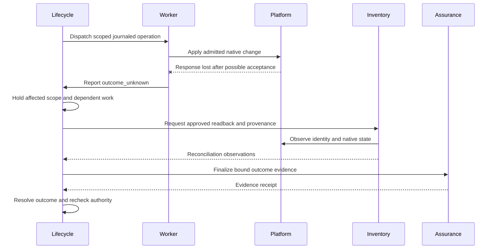

# Worked application: Permit Desk

Status: synthetic design example, 2026-10-04. Every record and outcome below is illustrative of the required future behavior. Nothing here is execution evidence, approval, platform support or a completed phase. The final wire formats are proposed in [contract examples](../contracts/examples.md); this page explains their product meaning.

## 1. Scenario and acceptance scope

Permit Desk is a fictional internal application with a Linux web workload and a Linux relational-database workload. It stores synthetic permit records and attachments. It is small enough to rehearse completely but includes state, tier isolation, shared services and a real recovery boundary.

P07 provisions OpenStack through native APIs. P08 selects one explicitly qualified migration method from source and destination capability profiles. Generic whole-VM movement uses an isolated migration copy, `ExportVm`/NFC, verified transfer, any explicitly planned copy-only conversion and destination native APIs. Guest transformation occurs on the copy. Restarting production after a baseline requires a qualified application or file delta method; opaque workloads without one require cold migration. No method is an automatic fallback. Native provisioning and migration require separate Q05/Q06 and Q07 qualification.

| Record | Synthetic value and purpose |
| --- | --- |
| Tenant/application | `t_demo`, `app_permit` |
| Logical workloads | `wl_web` presents the UI/API; `wl_db` owns the application database and attachments dataset |
| New deployment | `dep_permit_lab` in `env_lab`, initially has no managed native resources |
| Migration deployment | `dep_permit_move` in `env_move_lab`, initially runs on a VMware source under explicitly established source-operation authority |
| WSDs | `wsd_portal` groups presentation workloads; `wsd_data` groups stateful data workloads; both belong to `t_demo` |
| Security domains | `sd_oz` and `sd_rz`; logical zone class and security authority remain explicit |
| Placement | `wl_web` → `wsd_portal`/`sd_oz`; `wl_db` → `wsd_data`/`sd_rz` in each environment-specific intent |
| Endpoints | `ep_vmware_lab` source, `ep_openstack_lab` target; actual addresses and secrets stay in approved endpoint/secret systems |
| Dataset | `ds_permits` includes database and attachment storage, schema/metadata, key requirements and an explicit consistency group |
| Required connectivity | Authorized client → web HTTPS; web → database selected database port; workload → individually approved identity, DNS/time, logging, monitoring and backup services |
| Denied connectivity | Unapproved clients → database, other tenants → either tier, unsolicited database → web sessions, and unintended direct cross-zone paths |
| Expected service | Selected guest hardening, authenticated application access, valid DNS/address allocation, usable monitoring/backup and exercised restoration |

Do not derive network permission from a domain label. P00 selects the actual security topology and required inspection; plans declare enforcement, forward/reply paths and controlled interfaces. Shared-service endpoint names are synthetic examples; actual endpoints require selection by their service owners. No vendor integration is presumed implemented.

The fixture manifest must include a reproducible seed, full dataset inventory, known record/attachment checks, role-based application actions, observed source baseline and restore checks. For example, preserve the exact set of permit IDs, row counts, attachment digests and ownership relationships, then demonstrate a new permitted write after activation. A passing ping or VM boot does not satisfy the application checks. P00 assigns and approves outage, performance, retention and data-loss thresholds; illustrative data here creates no accepted target.

## 2. P03–P05: register, discover and review

| Step | Owner and input | Record/output and visible result |
| --- | --- | --- |
| 1. Establish scope | Governance confirms the requester's effective `t_demo` access and environment/resource scope | The console displays only authorized environments and actions; a known foreign-tenant ID is still denied |
| 2. Register application | Catalogue receives `POST /v1/tenants/t_demo/applications` with a complete valid initial intent and `Idempotency-Key` | Creates `app_permit`, its stable workload definitions and seed revision `ir_prov_00` for `dep_permit_lab`/`env_lab`, including required placements, accountable owners and acceptance requirements; returns the strong application ETag |
| 3. Revise intent | Catalogue receives `POST /v1/tenants/t_demo/applications/app_permit/intent-revisions`, authenticated identity, `If-Match` and a new `Idempotency-Key` | `ir_prov_01` names `ir_prov_00` as parent and snapshots the complete revised `dep_permit_lab`/`env_lab` placements, datasets, flows, requirements and pinned policy references; emits `catalogue.intent-revision.created` |
| 4. Discover endpoints | Inventory collects under separately granted read-only authority | `obs_os_01` and `obs_vm_01` identify complete/fresh generations, provenance, native identities and installed tuples; source discovery alone does not confer management rights |
| 5. Request assessment | Planning receives `POST /v1/tenants/t_demo/assessments` referencing `ir_prov_01` and candidate input versions | Returns `assessment_id=as_prov_01`; the console polls assessment status, which is separate from execution Job status |
| 6. Review fit | Planning evaluates required capabilities, security/services, freshness, quotas and qualified support | `planning.assessment.completed` reports requirement-level findings, `unknown` values and remediations; available capacity is explicitly not reserved capacity |
| 7. Compile plan | Planning receives `POST /v1/tenants/t_demo/plans` for the accepted scope | `plan_prov_01` binds the intent/input versions, action graph, exact execution artifacts, native scope, qualification-campaign lane, expiry and recovery conditions; emits `planning.plan.created` |

A retry of step 3 with the same idempotency key and canonical payload returns the same result. Reusing that key with a changed payload produces `409`; an independent write using a stale ETag produces `412`. The user sees the current revision and can review the conflict before publishing a new revision.

An ordinary assessment may find the proposed route technically feasible while operational admission is blocked by missing qualification. This is expected for the first implementation. The product must identify the gap instead of converting an adapter declaration into qualified support. An approved isolated campaign can then exercise that candidate to produce evidence.

These IDs describe one coherent future run, not a plan kept valid across months of development. At native execution time, observations, artifact versions, campaign limits and all other material inputs must be current and bound into the reviewed plan. A changed input produces a new plan/digest and corresponding approval; the original P05 example is never grandfathered into P07 authority.

The approver's decision uses their own authenticated identity and required separation of duties; the requester cannot self-assert an approver field. This diagram abbreviates inventory, qualification and freshness checks, which remain required at admission.

## 3. P06: approval, simulation and fault behavior

`plan_sim_01` is a separate plan that binds simulator endpoints and artifacts. Governance records `ap_sim_01` through `POST /v1/tenants/t_demo/approvals`; `governance.approval.recorded` carries the decision reference. Lifecycle receives `POST /v1/tenants/t_demo/jobs` with plan/digest and approval references and returns `job_sim_01`. Its dispatch and job records commit durably before workflow dispatch; duplicate requests cannot start a second logical job.

The simulator runs the same contract and workflow boundaries with controlled doubles for native operations. Simulated site, job, evidence and UI records carry a visible synthetic/simulation designation. Native qualification remains absent. Required injected cases include duplicate delivery, crash before/after effect acceptance, lost acknowledgement, expired authority, revocation, stale worker/fence and partial service allocation.

No simulated approval, evidence artifact or successful native-looking response is eligible for reuse as native qualification.

## 4. P07: first native OpenStack provision

Before native work, commissioning must establish the exact target tuple, approved credentials, transport, quotas, network/security/storage realization, guest artifacts and shared-service contracts. P01 operating controls and P06 gates must pass. The first native attempt uses an explicitly approved isolated qualification campaign, `campaign_prov_01`, with bounded endpoints, synthetic datasets, operations, impact, retention and emergency stop procedure.

Governance records `ap_prov_01` against `plan_prov_01` and its exact digest with campaign authority and a reviewed window. Lifecycle validates that scope, current grants, preconditions and evidence requirements before admitting `job_prov_01`. Ordinary operational authority still requires an existing current qualification; campaign authority supplies no production permission.

| Order | NativeOperation or record | Effect, owner and expected evidence |
| --- | --- | --- |
| 1 | `op_prov_reserve` | Lifecycle journals scoped capacity/IP allocations; authoritative allocation owners return receipts. Partial allocations are reconciled or explicitly compensated. |
| 2 | `op_prov_domains` | Realize or bind approved isolated domain/network scopes; inventory observes `di_os_oz_01`/`di_os_rz_01`; lifecycle records `mdb_oz_01`/`mdb_rz_01` with ownership/fencing. Required shared infrastructure is already commissioned. |
| 3 | `op_prov_compute` | Apply the reviewed native operation plan to create exactly the scoped workload resources in quarantine. Persist execution/state identity and result; prohibit another adapter from concurrently owning the same fields. |
| 4 | `op_prov_guest` | Scoped guest activities configure only admitted fields, identity, time/trust and hardening. Record exact guest/automation artifacts and readiness results. |
| 5 | `op_prov_services` | Register DNS, monitoring/logging and backup through owner contracts, retaining authoritative receipts and observable service checks. |
| 6 | `ev_prov_restore_01` | Restore protected synthetic data into an isolated validation target and verify application/dataset checks; a successful backup job alone is insufficient. |
| 7 | `op_prov_activate` | Revalidate authority and preconditions, observe mandatory policy outcomes, then enable only declared application access. Capture positive and negative traffic checks. |
| 8 | `ev_prov_accept_01` | Independent readback verifies native state, application login/read/write, required service paths, protection and actual timings. Lifecycle emits `lifecycle.job.completed` only when completion postconditions and mandatory evidence receipts are satisfied. |

Names here identify logical operation scopes, not a requirement to hide many irreversible effects in one unobservable call. P06 must split any scope that needs different authority, fencing or recovery into separately journaled operations. Native operation payloads, custody generation, ownership and fencing must be bound and reconciled; an uncertain native request is never blindly repeated.

The observer shown above does not repair native resource custody or acquire write authority. If native readback alone cannot resolve execution/state identity or stale-writer risk, the hold remains for the declared operator recovery procedure.

After Q05/Q06 and applicable fault/recovery checks succeed, assurance independently reviews the dossier and may record `qual_prov_01` plus `assurance.qualification.published`. This future decision would cover only its exact provision/activation/retirement scope, tested artifacts and tuple. Subsequent ordinary provisioning still needs its own plan approval, current admission checks and the operating release's accepted scope.

To qualify retirement, create a separate `plan_retire_01`, obtain `ap_retire_01` and run `job_retire_01`. Verify retention obligations, delete only managed scope, release allocations after native absence is confirmed and retain required evidence. Original provisioning approval does not authorize deletion.

## 5. P08: VMware-to-OpenStack native VM copy

The migration deployment is distinct from fresh provisioning. Its approved plan
binds the source VM/configuration, complete disk inventory, firmware/drivers,
source and destination APIs, destination images, transfer custody and independent
writer-fencing requirements. Source-operation authority covers application quiescence, shutdown, snapshot and isolated clone capture; export and transformation operate on the copy; discovery alone grants none of it.

| Step | Required action and completion condition |
| --- | --- |
| Assess and plan | Discover both native endpoints and image capabilities; validate every disk, device, guest prerequisite, service dependency and outage/data objective. Unsupported combinations hold. |
| Rehearse | Copy an approved representative source into an isolated target with business effects suppressed; verify boot, all data, services and policy before cleanup. |
| Approve cutover | Bind current source configuration, destination scope, reviewed API artifacts, custody, reservation receipts and accepted rehearsal evidence. |
| Fence source | Quiesce all application/other writers, record the last accepted transaction, power off the exact VM and independently verify the source fence. |
| Capture and export copy | Create consistent S0 and an isolated powered-off clone bound to S0, with production NICs disconnected. Invoke `ExportVm` on the clone once, record the NFC lease/OVF mapping and transfer all approved disks through allowlisted TLS URLs with lease keepalive. |
| Verify and transform copy | Check native manifest inventory, capacities, lengths and secure checksums. Complete the lease only after export. Execute only the planned isolated conversion and guest transformations; never modify production drivers/tools. |
| Import disks and reconcile data | Use the selected native image/volume import and verify IDs, ownership and post-conversion digests. A source resumed after S0 requires its qualified final application/file delta before activation; cold export keeps the source stopped. |
| Create isolated target | Execute the native volume/port/compute plan with exact imported-image mappings and disabled traffic ports. Verify boot and guest prerequisites. |
| Validate | Independently check all data and attachments, application roles, service owners, backup recovery and allowed/denied traffic. Target writes remain blocked. |
| Activate | Recheck current authority, source fencing and all acceptance results before target writes and traffic changes. Record the first-write boundary. |
| Accept and retain | Review Q07 evidence for the exact route. Preserve source disks/data/keys until a separate retirement plan and authority. |

A lease or import timeout holds the original attempt. The immutable plan selects its
method and any copy-only converter; neither is replaced automatically after failure. Recovery before target writes and recovery after possible
accepted target writes remain separate approved procedures.

## 6. Held outcomes, revocation and recovery decisions

| Event | What the user sees | Required system behavior and exit condition |
| --- | --- | --- |
| Native create/apply response is lost | `job_prov_01` is held; `op_prov_compute` is `outcome_unknown`; `lifecycle.job.held` records a reason | Retain the affected resource/fencing scope and stop dependent writes. Observe native identity, intended state and automation state. Resume only after outcome and writer ownership are established, current authority remains valid and the defined next step is safe. |
| Native resource exists but provider/state identity is unresolved | Held with authoritative observations attached; no misleading success badge | Follow the reviewed reconciliation procedure. Do not issue a new create, discard state or auto-release live allocations. If a repair changes scope, compile and approve a recovery plan. |
| Approval revoked before the next privileged effect | Approval displays revoked; job displays the blocked boundary | Governance records `governance.approval.revoked`. Lifecycle rechecks current authority, stops new privileged work and truthfully observes already dispatched work. Revocation does not erase an effect or automatically authorize compensation. |
| Approval revoked during source fencing | Held with the known/unknown source condition | Maintain containment without assuming the source is running or safe. Continue only authorized readback; privileged recovery requires applicable fresh authority. A policy-defined emergency action must be separately designed, scoped and audited. |
| Operator requests cancellation while transfer/restore is running | Cancellation requested; actual in-flight operation status remains visible | Stop at declared safe points, record partial data/resources and execute only already-authorized cleanup. Cancellation is not proof that native work stopped or was reversed. |
| Target validation fails before target writes are enabled | Recovery decision available, identifying verified source state | A pre-approved pre-write rollback may restore the source service after stopping/fencing the target and verifying its lack of accepted writes. Observe single-writer authority and traffic restoration before declaring recovery. |
| Failure after target writes were enabled or their occurrence is uncertain | Post-write recovery required; old-source restart is blocked | Preserve the accepted/possibly accepted target changes and fence competing writers. Use approved forward recovery on target, or a separately demonstrated source-return/data-reconciliation procedure. Unknown write history is treated as possible divergence. |
| Qualification is revoked before another privileged step | Held with revoked capability reference | Recheck applicable qualification and authority. Evidence from an earlier successful step does not authorize later work under invalid support conditions. |

**Rollback before target writes** restores the previously authoritative source using a rehearsed procedure after proving the target cannot have accepted divergent writes. **Forward recovery after target writes** repairs or restores the target while preserving the accepted data lineage. Source return after divergence is a separately designed and qualified procedure; without it, the route must explicitly limit recovery to forward recovery and the application owner must accept that constraint before migration.

A new recovery plan binds the observed starting condition, current resource ownership, evidence and allowed effects. It receives the required approval and its own admission; the original job links to that recovery job instead of pretending the original immutable plan changed.

## 7. Expected evidence bundle and traceability

| Evidence record/example | Required contents | Requirements / campaign |
| --- | --- | --- |
| `ev_intent_01` | Published intent digest, ownership/placement validation and synthetic fixture manifest | R05–R07, Q01 |
| `ev_discovery_01` | Source/target observation generations, coverage, timestamp/expiry, native identities and tuple provenance | R08–R11, Q02 |
| `ev_plan_01` | Plan digest, input/artifact versions, action graph, policy findings, budgets and recovery boundary | R12–R14, Q03 |
| `ev_authority_01` | Plan-bound approvals, applicable grants, campaign/operational lane and boundary-check records; no credentials | R03, R15–R16, Q03–Q04 |
| `ev_effects_01` | Operation ledger and attempt references, native request/resource identities, fencing, allocation/service receipts and independent postconditions | R15–R18, Q04–Q05 |
| `ev_policy_01` | Allowed/denied paths including same-host/subnet and tenant isolation, inspection/return paths and selector protection | R07, R20–R21, Q06 |
| `ev_data_01` | Capture/transfer manifests, dataset checks, final consistent baseline, source fencing, target write boundary and accepted target checks | R22–R24, Q07 |
| `ev_recovery_01` | Injected faults, lost-response holds, revocation outcomes, restore results and pre-/post-write recovery observations | R15–R16, R24, R29, Q04/Q07/Q09 |
| `ev_acceptance_01` | Independent application checks, measured outage/performance, security/service-owner review and explicit limitations | R18–R24, R33–R35, Q05/Q07/Q10 |

Every finalized artifact requires a verified digest, producer/observer, timestamp, source revision, exact tested environment/tuple and protected custody reference. A dossier must distinguish E0 design examples, E2 simulation, E3 native qualification and E4 operating acceptance. This walkthrough itself is E0 only.

The final trace should let a reviewer move from requirement → work package → intent/contract → plan and decision → admitted job → native effect → observation/evidence → qualification → release support row. The authoritative field owners and work-documentation structure are defined by the [documentation guide](../documentation-guide.md) and implementation registers; do not copy completion flags into this example.

## 8. What changes for the pilot

P10/P11 replace the synthetic fixture and isolated campaign authority with the approved pilot tenant/application, accepted production topology, operational support ownership and current qualified tuples. They repeat the required install, recovery, access, native and application checks on release artifacts. Native lab qualification is necessary input; production commissioning, current change approval and receiving-team acceptance remain separate obligations.

Keep the synthetic example reproducible as a contract and user-journey fixture. Add actual campaign records and sanitized acceptance references beside implementation work; do not overwrite the example to make a hypothetical transcript appear to be a real run.
