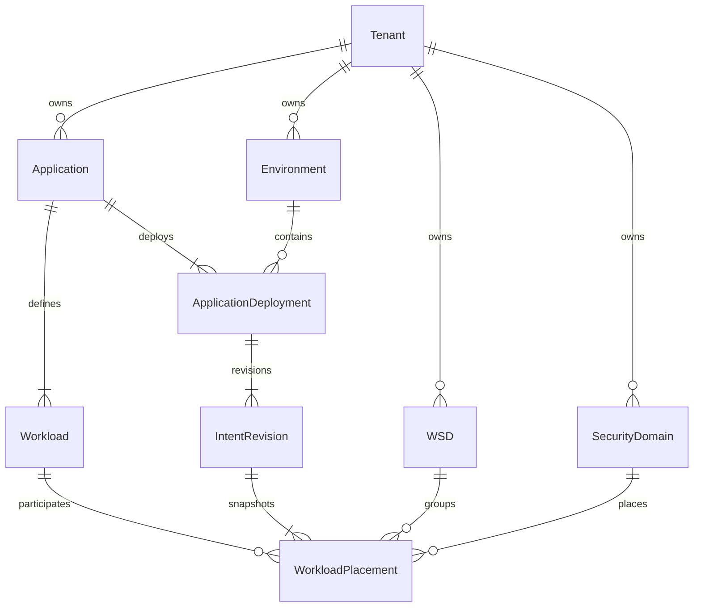
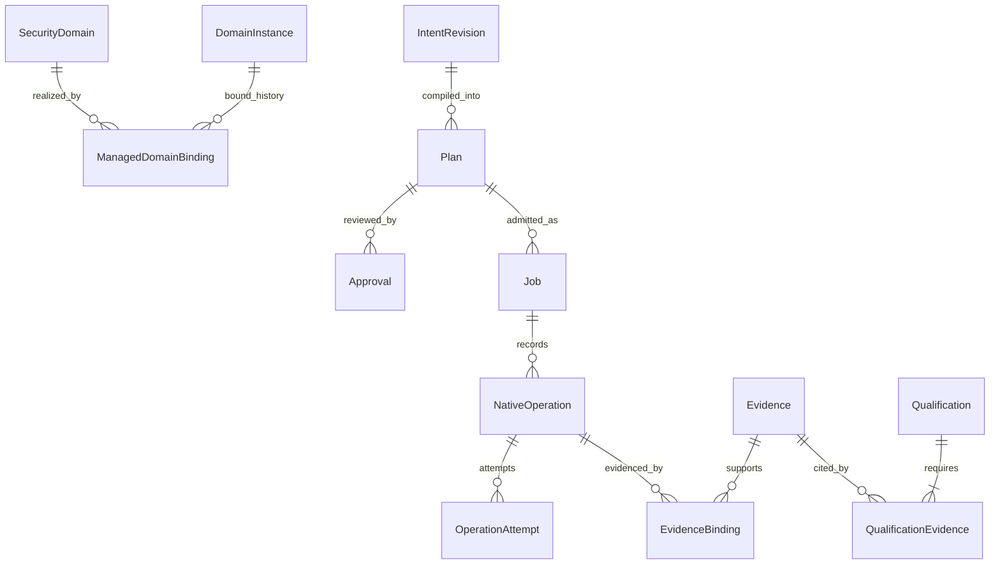

# Product domain model

Status: proposed ADR-013 specification, 2026-10-04. This page makes the planned relationships reviewable; it does not resolve ADR-013 or approve a database schema. P00 validates representative examples and ownership; the decision must close before P03 schema implementation. All IDs and values below are synthetic.

## Terms and record ownership

Each record has one authoritative writer. Cross-context references are IDs and version/digest references validated through contracts, not shared database foreign keys. Ownership of a record is distinct from authority to mutate a native resource.

| Entity | Authoritative owner | Meaning and required identity |
| --- | --- | --- |
| Bootstrap administrator | Governance | One installation-local identity with password hash, mandatory first-login change, scoped grants and retirement at verified external OIDC activation; no plaintext password record |
| Identity connection | Governance | Revisioned external OIDC provider/client settings, claim mappings, secret references and tested activation state; configured through the console |
| Tenant | Governance | Administrative and authorization allocation with memberships, entitlements and delegated scope; `tenant_id` |
| Environment | Catalogue | Tenant-owned deployment context such as test or production; `environment_id`, `tenant_id`; does not itself prove network isolation |
| Application | Catalogue | Tenant-owned business grouping with accountable service owner and acceptance requirements; `application_id`, `tenant_id` |
| Workload | Catalogue | Stable logical component belonging to one application; `workload_id`, `application_id`, `tenant_id`; native VM IDs are separate references |
| DatasetDefinition | Catalogue; part of versioned application intent | Logical data and consistency requirements with `dataset_id`, accountable data owner and consistency-group identity; native volumes, backup copies and transfer artifacts have separate provenance |
| ApplicationDeployment | Catalogue; proposed association | One application in one environment; `deployment_id`, `application_id`, `environment_id`, `tenant_id`; separates environment-specific intent from the reusable application identity |
| WorkloadSecurityDomain (WSD) | Catalogue | Tenant-owned grouping by service ownership, lifecycle and security/recovery requirements; `wsd_id`, `tenant_id`, accountable owner and policy references |
| SecurityDomain | Catalogue | Tenant-owned logical zone instance with zone class and security authority; `security_domain_id`, `tenant_id`; zone taxonomy such as OZ/RZ is a reusable value, not a shared tenant boundary |
| IntentRevision | Catalogue | Immutable desired state for one ApplicationDeployment; `intent_revision_id`, parent, schema version, actor, canonical digest and complete requirement/placement snapshot |
| WorkloadPlacement | Catalogue; contained in IntentRevision | Places one workload in that revision with exactly one WSD and one logical SecurityDomain, plus compute, dataset, network and service requirements |
| DomainInstance | Inventory | Observation of a native routing/enforcement context at an endpoint; stable observation identity includes endpoint, native ID and generation/incarnation provenance |
| Observed native workload | Inventory | Exact endpoint/resource/incarnation facts in an immutable observation generation; neither a workload name nor a discovered VM assigns Catalogue identity or mutation authority |
| ManagedDomainBinding | Lifecycle; proposed managed record | Authorized mapping of one native isolation scope to one tenant/logical domain, with resource/field ownership and fencing epoch; does not rewrite the DomainInstance observation |
| ManagedWorkloadBinding | Lifecycle; proposed managed record | Reviewed association of logical workload/deployment with an exact native resource incarnation, source/target/retained role and field-owner schedule; simultaneous migration bindings do not permit simultaneous data writers |
| Assessment | Planning | Explained requirement fit against pinned intent, observations, policy and capability versions; asynchronous assessment identity is not a native-execution Job |
| Plan | Planning | Immutable proposal for one deployment/intent and operation scope; binds action graph, inputs, artifacts, preconditions, expiry and recovery rules to a digest |
| Approval / Revocation | Governance | Immutable, attributable authorization decision bound to exact plan digest, scope, conditions and time bounds; revocation is a new decision record |
| Job / Admission | Lifecycle | One admitted execution identity and its checks; rejected admission is auditable but creates no executable job; user-facing progress is a projection of durable workflow history |
| NativeOperation | Lifecycle | One logical native effect under a Job, with durable identity, target/field scope, fencing and attempts/outcomes; retry does not create a second logical effect |
| Reservation journal | Lifecycle | Intent, attempt and receipt for a scoped reservation operation, bound to exact demand/envelope digest, generation and external owner; authoritative capacity/IPAM/DNS systems retain allocation truth |
| Evidence | Assurance | Metadata and protected artifact references for a stated observation or claim, with digest, producer/observer, environment, time, custody and source bindings |
| Qualification | Assurance | Reviewed support decision over an exact operation tuple and product artifacts, supported by evidence, limitations and revalidation rules |

## Application and placement cardinalities

The proposed create-application command accepts a complete valid initial intent, establishing its first deployment and immutable revision atomically. A user may compose an incomplete console draft before submission, but this does not create an accepted catalogue revision; a dedicated persisted draft API is outside the first slice. Reference aggregates such as WSDs may exist before a placement uses them. Every published intent includes at least one workload placement and passes the invariants below. The diagram describes logical references, not physical cross-service joins.

| Association | Proposed rule and rationale |
| --- | --- |
| Tenant → Application/Environment/WSD/SecurityDomain | Each child belongs to exactly one tenant. Matching names or zone classes across tenants never merge their authority boundaries. |
| Application → Workload | Each workload definition belongs to exactly one application. A shared service used by several applications is a separately owned dependency/attachment, not the same workload silently owned by several apps. |
| Application ↔ Environment | Many-to-many through ApplicationDeployment. Initially one active deployment identity per application/environment pair; later regional instances require an explicit extension to the key. |
| ApplicationDeployment → IntentRevision | One or more immutable revisions with a current pointer; creation supplies the first valid revision. Each later revision has one parent from the same deployment; divergent drafts must be resolved before publication. |
| IntentRevision → WorkloadPlacement | Each included workload appears exactly once. The published snapshot includes its full effective requirements, resolved defaults and version references, so later default changes cannot alter old intent. |
| WorkloadPlacement → WSD / SecurityDomain | Exactly one of each within a revision. One application may span multiple WSDs and domains. A WSD may group workloads across applications and environments within its tenant. |
| WSD ↔ SecurityDomain | Many-to-many through workload placements; neither automatically determines the other. WSD ownership/recovery grouping is not a zone label. |
| WorkloadPlacement → network attachments | One or more declared attachments if networking is required. Every attachment must remain within its placement's approved domain scope; multi-NIC is not an implicit bridge between zones. Cross-domain appliances require a separately designed and qualified exception profile. |
| SecurityDomain → native realization | Zero or more approved ManagedDomainBindings across sites/endpoints. Every active native isolation scope has one tenant/domain owner; historical binding records retain prior epochs. |

These are deliberately concrete proposals for review. P00 must specifically validate whether one active deployment per application/environment and one domain per ordinary workload cover real workloads. If not, change ADR-013 and its examples before generating contracts; do not encode undocumented exceptions.

## Native realization and execution cardinalities

An active ManagedDomainBinding is unique for a native isolation scope. Several historical bindings may reference a DomainInstance, but overlapping active owners are invalid. Native ID reuse requires a distinct incarnation identity and fresh validation; it must not silently attach a new resource to an old binding. Inventory may observe an unbound DomainInstance without granting lifecycle any write authority. One network belongs to exactly one native DomainInstance; one DomainInstance may contain multiple networks.

A logical workload can retain source and target ManagedWorkloadBindings during migration, with explicit active, candidate or retained roles. Neither binding changes its stable workload identity. Dataset requirements remain Catalogue intent; Inventory records observed storage facts, while Lifecycle binds transfer/copy lineage and single-writer transitions to its operation journal. A target's existence is not permission to enable data writes, and a retained source is not permission to resume its old writer. Sensitive field ownership identifies the native scope, responsible controller and epoch; a service's database ownership alone does not prove native fencing.

Reservation expiry is not evidence that resources are unused. Lifecycle preserves an uncertain reservation or dependency receipt until the external owner and native observations establish a safe disposition. Changing demand or an envelope digest under the same operation identity is a conflict. Planning's capacity assessment and Inventory's free-capacity observation never decrement an authoritative allocation or transfer its ownership.

A plan may have multiple approval decisions to satisfy distinct authorities and multiple historical admissions, but an idempotent retry returns the same logical Job. A later intentional rerun needs a fresh admission and renewed validation; completed effects are never replayed merely because the plan was once approved. A Job references the exact approval set used at admission and any subsequent revocations. Before each privileged boundary, current authority and qualification are checked again.

EvidenceBinding is a logical metadata link. Evidence may also bind a plan, intent, observation generation, application acceptance or campaign directly. The many-to-many relationship does not permit changing a finalized evidence claim to cover a different effect. Additional claims need independently reviewed bindings and compatible scope.

## Invariants to implement and verify

| ID | Rule | Enforcement owner / first meaningful check |
| --- | --- | --- |
| DM-01 | Every tenant-owned reference in a write must resolve to the authenticated tenant and permitted resource scope. Tenant IDs are selectors, not proof. | Owning service; P02/P03 cross-tenant negative API tests |
| DM-02 | Placement references an existing workload of the same application, the deployment's environment, and same-tenant WSD/domain. | Catalogue; P03 publication validation |
| DM-03 | Dependencies name explicit endpoints/datasets, direction and lifecycle ordering; cycles in execution ordering are rejected or explicitly decomposed. | Catalogue validates structural graph; planning validates executable ordering in P05 |
| DM-04 | Published intents and plans are immutable. A material change creates a new identity/digest and requires new plan approval. Stale revision writes are rejected. | Catalogue/planning/governance; P03/P05 concurrency and binding tests |
| DM-05 | ZIP represents a controlled inter-zone interface, never a workload zone. Zone membership alone does not prove enforcement or approved connectivity. | Catalogue/planning; P03 invalid placement and P07 native policy tests |
| DM-06 | An observation cannot claim resource ownership, reservation, write commissioning or qualification. Missing and stale observations remain explicit. | Inventory/planning; P04/P05 provenance and freshness cases |
| DM-07 | One native resource/field scope has one active mutation owner and fencing authority. Domain binding and Terraform state ownership must agree. | Lifecycle; P06 collision/fencing tests and P07 native readback |
| DM-08 | Plan input versions, native scope, action graph, artifact digests, recovery policy and declared expiry are bound before review. Native credentials are never embedded. | Planning; P05 canonical contract checks |
| DM-09 | Approval authorizes only its exact plan digest, operations, environment, conditions and time window. Revocation/expiry prevents new privileged work. | Governance/lifecycle; P06 authority boundary tests |
| DM-10 | A native timeout is `outcome_unknown`, not proof of failure. Keep the resource held until authoritative observation and reconciliation establish a safe outcome. | Lifecycle; P06/P07 lost-response and stale-worker campaigns |
| DM-11 | Target write enablement requires observed source/other-writer fencing and the approved recovery boundary. Once target writes occur, restarting source is not an automatic rollback. | Lifecycle/application owner; P08 divergence and cutover campaigns |
| DM-12 | Operational execution requires a current qualified tuple. The isolated campaign lane tests candidates only within its approved endpoints, dataset and impact budget. | Lifecycle/assurance; P06 admission and P07/P08 qualification cases |
| DM-13 | Retiring resources, releasing allocations or disposing of data needs explicit scope and authority. Referenced records and required evidence cannot be removed by ordinary catalogue deletion. | Catalogue/lifecycle/assurance; P07 retirement and retention tests |

## Valid and invalid examples

| Example | Result and reason |
| --- | --- |
| `app_permit` contains `wl_web` in `wsd_portal`/`sd_oz` and `wl_db` in `wsd_data`/`sd_rz`, all owned by `t_demo` | Valid proposed model: one application spans two lifecycle/security groupings and logical zones. Required web-to-database flow is a separately declared interface. |
| `wl_web` has a lab placement and a production placement in separate deployment intents | Valid if each environment's WSD/domain references, grants and policies are explicit; lab qualification does not itself authorize production deployment. |
| Two applications depend on a tenant-owned DNS service through approved attachments | Valid shared-service relationship; neither application becomes the owner of the DNS infrastructure. |
| Two tenants each define a domain with zone class `OZ` and use overlapping private addresses | Potentially valid only with distinct qualified routing/enforcement contexts. The repeated label or address never merges the contexts. |
| `t_demo` intent references another tenant's `wsd_data` or application workload | Invalid DM-01/02, even if the identifier is known or the display names match. |
| A workload is assigned to `ZIP` as if it were a zone | Invalid DM-05; model the controlled interface and the actual endpoint domains. |
| A second NIC is added in another zone to bypass the approved interface | Invalid ordinary profile under DM-05/07; any supported cross-domain appliance requires explicit design and separate qualification. |
| Discovery matches a native VM name and directly claims it as managed | Invalid DM-06/07; name matching is a proposal, with identity and ownership proof required before adoption. |
| Operator edits a plan's target subnet after approval and preserves the old digest | Invalid DM-04/08/09; generate a new plan and obtain applicable approval. |
| API timeout causes an immediate second create request with a new native-operation ID | Invalid DM-10; reconcile the existing operation and native resource first. |
| After target writes, recovery powers the old database back on using its pre-cutover data | Invalid DM-11 unless a separately approved, demonstrated reconciliation procedure preserves accepted target changes and single-writer authority. |

## Open decisions and change discipline

ADR-013 must settle deployment keys, WSD sharing, ordinary workload domain cardinality, domain-binding uniqueness, default resolution and reference-retention behavior. ADR-009 settles concrete authorization policy; ADR-014 selects the route; ADR-018 settles campaign admission. The [decision register](../decisions/decision-register.md) owns their status and deadlines.

The [P00 domain and ownership review](../implementation/p00-domain-review.md) records the executed design walkthrough, historical-source dispositions, recommended decisions and command/event concurrency cases. Its analytical conclusions refine this proposal; they are not owner acceptance, implemented schemas or runtime test evidence.

P01/P03 schemas must reference DM invariant IDs and add both valid and invalid fixtures to the appropriate owning service. Changes to meaning or cardinality update this page, the ADR, [service specifications](../services/README.md), [contract examples](../contracts/examples.md) and [the walkthrough](application-walkthrough.md) together. Implemented contract versions and migration behavior become authoritative only after the corresponding decision and delivery gates; this proposal alone is E0 design material.
