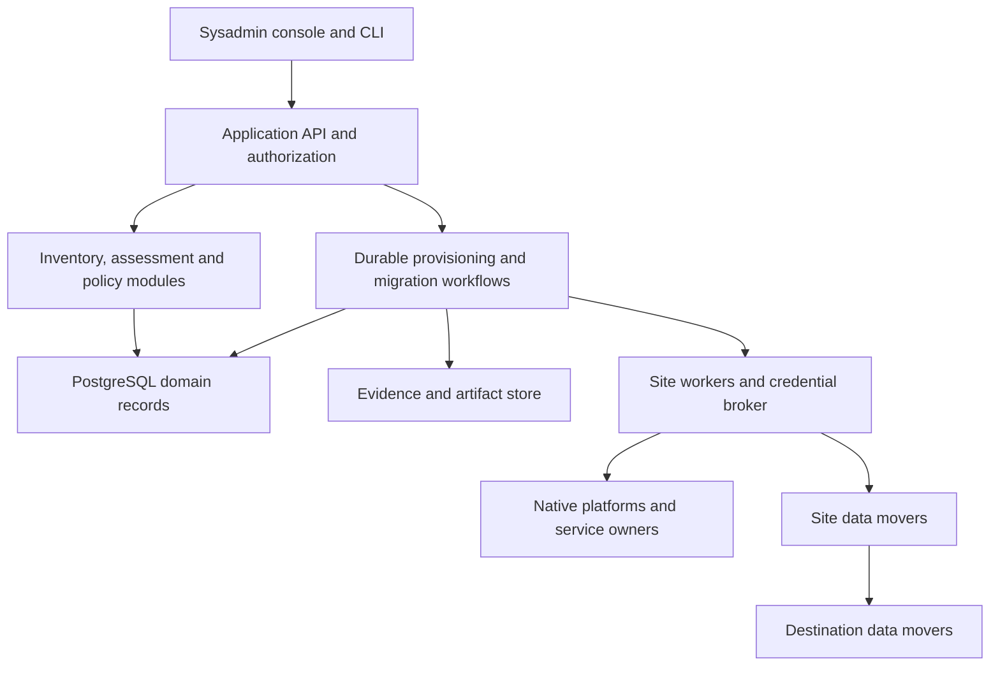
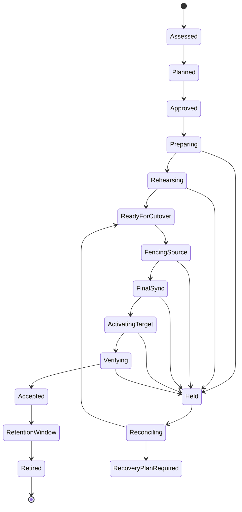

# Enterprise workload provisioning and mobility

## Repository audit and full implementation plan

> Historical audit at the revision below. For the corrected current B01–B50 status,
> dependencies and implementation order, use the [all-wave execution plan](enterprise-workload-mobility-execution-plan.md).

**Repository:** `awalker0878/multi-tenant`  
**Audited revision:** `e5347986cb736df525c1fc3ace100af26d2d4f27` (`main`)  
**Audit date:** 26 September 2026  
**Audience:** enterprise system administrators, platform engineering, network/security engineering, application owners and operations.  
**Deliverable:** source-grounded audit, proposed product architecture, implementation backlog, deletion plan and release acceptance criteria. This document does not claim implementation, deployment or native platform qualification.

## 1. Decision

Build this into an **enterprise workload mobility control plane**: a system that discovers existing workloads, shows administrators which on-premises destinations are viable and why, provisions the required destination services, then executes and verifies a controlled migration.

The current repository is a substantial architecture, planning, assurance and lower-level automation foundation. It is **not yet a complete provisioning and migration application**. Public `apply` and `mobility-apply` intentionally refuse execution. Some underlying tools perform real changes, but the generated delivery graphs do not yet form a complete operational workflow. Migration is principally a rebuild-and-restore planning contract, rather than discovery and movement of arbitrary existing virtual machines.

Do not discard the entire codebase. Preserve useful safety properties: deterministic plans, generation and digest binding, one writer per native object, exact saved Terraform plans, deny-first provisioning, native readback, explicit uncertainty holds, qualification evidence and controlled retirement. Change the product boundary and build the missing execution, discovery, migration and operator layers around properly packaged versions of that code.

The biggest architectural change is to separate:

- **Workload and application intent:** what runs, its dependencies, data, service objectives and constraints.
- **Workload security domain (WSD):** the policy, isolation and placement boundary surrounding workloads.
- **Platform realization:** how an installed VMware, Nutanix, OpenStack or future platform satisfies those requirements.
- **Migration:** a directed, method-specific operation between two concrete source and destination instances.

An administrator must be able to ask: “Where can this application move, what must change, what will it cost in capacity and downtime, and can I recover if the move fails?” The product must answer from observed facts and tested capabilities, with explicit unknowns.

## 2. Audit scope and evidence rules

The audit inspected the complete repository tree and selected code paths through the CLI, placement, portability, adapters, delivery execution, Terraform and Ansible, state/owner services, security boundaries and tests. Source was retrieved through the authorized GitHub connection at the pinned revision. Repository-wide CI evidence was inspected separately from local targeted checks. This is a targeted engineering audit, not a claim of exhaustive security testing of every file.

No actual vCenter, Prism, OpenStack deployment, enterprise identity provider, production data, private site inventory or native qualification environment was supplied or contacted. Therefore installed-platform interoperability, throughput, RPO/RTO, application consistency and production readiness remain unproven.

Evidence categories used throughout:

| Label | Meaning |
|---|---|
| Observed code | Behavior follows from the retrieved implementation at the pinned revision. |
| Reproduced | A targeted offline check exercised the behavior. |
| CI result | GitHub job evidence for the same revision; does not prove native platform behavior. |
| Gap | A capability needed by the requested product is absent or incomplete in the inspected paths. |
| Proposal | A design or acceptance requirement for future implementation, not current functionality. |

Priorities below are delivery priorities. **P1** blocks a supported enterprise release; **P2** blocks broader usability, operational scale or maintainability. They are not vulnerability severity scores.

## 3. Current capability assessment

| Area | What is present | What remains necessary |
|---|---|---|
| Portable intent | Validated WSD requests, reviewed profiles, deterministic desired state and manifests | Existing workload identity, per-VM configuration, application groups and imported dependencies |
| Placement | Explainable site/cell/zone eligibility, qualification and capacity checks | Portfolio comparison, live discovery, performance history, migration-method feasibility and reservations tied to real execution |
| Provisioning | Candidate Terraform modules/compositions and native lower-level execution tools | An integrated authorized create-to-commission workflow, managed lifecycle and usable operator entry point |
| Guest configuration | Bound Linux configuration and service integration | More guest profiles; Windows; workload-specific bootstrap, verification and recovery |
| Mobility planning | Logical artifacts, capability/policy contracts, rebuild/restore intent and cutover evidence requirements | Native source bindings, executable source/destination workflow and qualified data movers |
| Data protection | Scoped restic capture/restore and receipts | Cross-scope transfer authorization, per-dataset mapping, application consistency and complete VM disks |
| Safety | Holds, saved-plan binding, local journals, scoped service owners, readback and containment concepts | Multiuser identity, durable distributed execution, cross-worker exclusion and independently checked writer fencing |
| User experience | CLI and JSON/artifact outputs | Workload inventory, comparison, remediation, rehearsal and execution console for sysadmins |
| Assurance | Extensive fixtures, regression tests, engine checks and qualification schemas | Current native qualification per installed tuple and migration direction/method |

**No percentage-complete estimate is justified.** Contract completeness, unit test count and deployment readiness are different measures. Track readiness by executable capability and qualified route.

## 4. Findings and required disposition

### F01 — Public execution stops at a handoff (P1)

`provisioner/cli/apply.py` explicitly refuses all changes (lines 1–6, 139–151). `provisioner/cli/mobility_apply.py` returns `EXECUTION_REFUSED_HANDOFF_READY` rather than executing a migration. `provisioner/cli/main.py` describes execution as refused by design.

**Impact:** administrators cannot provision or migrate through the advertised portable interface even after satisfying its planning checks. This is an intentional safety boundary, not evidence that the underlying tools are all stubs.

**Disposition:** replace the repository-only execution boundary with an authenticated application command that submits an approved immutable plan to a durable workflow. Continue to reject unauthenticated, stale, unsupported or unapproved operations. Do not turn refusal into execution with a `force` flag.

### F02 — The generated provisioning graph is not a complete lifecycle (P1)

`provisioner/execution/handoff.py:101–123` defines the ordinary delivery graph. Its bootstrap operation invokes `platform_transition`; `provisioner/execution/delivery_steps.py:247–256` produces a transition document with `TRANSITION_REQUIRES_EXACT_PLAN_REVIEW`. That draft is not followed by a generated saved-plan/apply/readback chain. Guest planning follows initial workload creation; the graph lacks a complete native bootstrap/power sequence. Activation acceptance records external evidence rather than itself implementing the exposure change. `complete()` and runner step completion accept owner result records, which must not be confused with proof of the required native state.

**Impact:** executing the current generated graph does not establish that workloads moved from prepared/quarantined resources to working guests and verified production connectivity.

**Disposition:** give each transition a typed result and postcondition. Generate explicit prepare-plan, approval, apply, task observation, power/start, guest readiness and service exposure activities. A draft transition can satisfy only a planning postcondition. It cannot complete a bootstrap or activation postcondition.

### F03 — Existing workloads are not the primary migration input (P1)

The mobility schema carries a source platform but lacks an inventory-bound set of existing native VM identities. `provisioner/execution/service.py:94–132` constructs source and destination plans from a WSD request and artifact resolution. One logical image is resolved for a WSD rather than an independently observed disk/device layout per existing VM.

**Impact:** the current abstraction fits rebuilding a known profile, but cannot faithfully describe an arbitrary brownfield application, its VMs, disks, NICs, installed OS, dependencies and external services.

**Disposition:** add discovered `Workload`, `ApplicationGroup`, `ObservationSnapshot`, `Dataset` and `MigrationPlan` models. Keep the WSD model as a shared security/environment boundary. Preserve immutable platform endpoint plus native ID identity; names alone are not identifiers.

### F04 — Migration methods and routes are too narrow (P1)

`provisioner/portability/migration.py` only accepts `rebuild-restore`, and rejects equal source/destination platform families. `provisioner/portability/data.py` only supports backup/restore via restic.

**Impact:** ordinary moves between two clusters or sites on the same platform are excluded. Complete VM migration, driver conversion, warm synchronization and application-native data migration are not implemented by this interface.

**Disposition:** use a directed route capability model keyed by installed source, installed destination, guest profile, data method and network mode. Implement same-platform relocation, rebuild/restore and cold VM conversion as separate methods. Add warm routes only after final-delta and fencing tests pass.

### F05 — Cross-platform restore conflicts with the current scope contract (P1)

The mobility graph is scoped to its target (`portability/handoff.py`). Delivery validation requires the restic configuration scope to equal that graph's scope (`provisioner/execution/delivery_steps.py:83–93`). Restore also requires the original backup receipt scope to equal the restore configuration scope (`provisioner/execution/restic_run.py:155–166`).

**Impact:** a correctly identified source backup and a distinct target cannot satisfy both equality conditions. Relabeling the source receipt would erase provenance and is not an acceptable workaround.

**Disposition:** create an explicit transfer contract with immutable `source_scope`, `destination_scope`, workload/dataset IDs, snapshot identity, source receipt digest, encryption/key references and dual-scope authorization. Validate the relationship without rewriting either scope. Preserve same-scope restore as a normal use of the same contract.

### F06 — Datasets are not fully bound to the execution graph (P1)

The mobility schema permits multiple datasets, but the handoff has a fixed restore step. The inspected packet checks bind the restic action, not a complete mapping from every dataset's source reference and digest to an explicit destination volume/path and verification result.

**Impact:** the approved description of data movement is not yet a complete executable transfer specification. A single restore result cannot prove all requested application data arrived correctly.

**Disposition:** compile one child transfer per dataset or consistency group; bind all receipts to the plan generation and group consistency point. Require completeness, volume order, ACL/ownership metadata where relevant, integrity checks and useful-data/application validation before admission to cutover.

### F07 — Cutover, source fencing and rollback are contracts, not an integrated execution path (P1)

`provisioner/portability/cutover.py` describes required evidence and correctly forbids restarting the source after destination writes without reconciliation. The migration handoff remains target-focused and leaves source writer fencing, final synchronization, traffic switch and retirement to external work.

**Impact:** no executable transaction currently maintains a verified single writer across both environments or recovers a partially completed cutover.

**Disposition:** implement the durable state machine in section 10. Independently observe source write exclusion, bind it to the final consistency point, then permit destination writes. Treat post-write return as a new reverse migration/restore decision, never a simple power-on of the old source.

### F08 — Operator approval and production identity need an application authority (P1)

`provisioner/execution/authority.py:39–86` validates recorded approval shape and digest binding; approver/reference strings do not authenticate the person or enforce current roles and expiry. Local service-owner and credential controls elsewhere are useful, but do not supply a portfolio-wide human authorization model.

**Impact:** the current external-authority boundary cannot simply be exposed as a multiuser API accepting uploaded approval JSON.

**Disposition:** implement enterprise SSO, scoped roles, separation of duties, approval expiry/revocation, step-up controls and immutable approval events. Preserve source/destination owner approval where required. Revalidate authorization immediately before each privileged or irreversible activity.

### F09 — Durability exists locally; enterprise distributed orchestration is missing (P1)

`provisioner/execution/execution_journal.py:45–59` uses local file locks and explicitly leaves distributed exclusion external. There are meaningful SQLite owner ledgers and local idempotency/transaction protections; it would be incorrect to say the repository has no durable state or reservation implementation.

**Impact:** a multiworker service needs one coherent job history, cross-worker leases, safe resumption, operation reconciliation and storage recovery beyond local command execution.

**Disposition:** introduce a durable workflow service and PostgreSQL domain state, with native-operation tracking, monotonic execution epochs, read-after-timeout reconciliation and fenced worker ownership. Import settled owner records once; do not run two writers against the same resource.

### F10 — Inventory and comparison are not a sysadmin discovery product (P1)

The CLI takes reviewed inventory documents and defaults to non-authoritative fixtures. `placement/resolver.py:11–25,50–51,145–149` uses a deterministic capability-count/available-vCPU ranking. The complete tree has no dedicated portfolio web application. Existing platform observers read selected objects; that is useful but distinct from broad continuous discovery.

**Impact:** an administrator cannot connect an environment, browse existing applications, select candidates and compare migration routes with observed performance and dependency information.

**Disposition:** implement read-only discovery, change tracking, import/review, application grouping and an explainable multi-destination assessment API/UI. Keep a safe exploration mode for unknown candidates; require stronger evidence before execution.

### F11 — Policy portability needs operation-level equivalence (P1)

The current policy capsule and translation code retain high-level profiles, required outcomes and service-binding checks. That is a useful starting contract, but it is not a complete import/translation/verification system for an existing application's flows, identity selectors, inherited policy, storage encryption, recovery controls and exception expiry.

**Impact:** retaining a profile name or accepting a target capability flag does not prove the same effective policy follows an existing workload.

**Disposition:** build a normalized policy model, explicit translation coverage and fresh native/traffic evidence. A target control must be equivalent, supported by an approved compensating control, or block migration. Unknown and lossy translations cannot silently widen access.

### F12 — Supported guest and lifecycle scope remains restricted (P1)

The inspected native guest playbook explicitly permits Ubuntu 24.04/systemd. Terraform resources retain quarantine/`prevent_destroy` protections. The restricted lifecycle transition path is not a complete resize, reimage, move, backup enrollment, recovery and retirement API; other reviewed Terraform changes may be possible through lower-level paths.

**Impact:** a generic enterprise hosting claim exceeds the implemented guest and managed lifecycle scope.

**Disposition:** publish an exact guest/action support matrix. Implement Linux and Windows commissioning, growth/change and retirement as explicit reviewed workflows. Preserve destruction guards until a separate retirement/disposal authority and plan exists.

### F13 — Compatibility residue survives the no-shim objective (P2)

`provisioner/adapters/base.py:340–363` exposes explicit compatibility projections. `provisioner/execution/terraform_apply.py:153–155` supplies a default for older receipt content. `provisioner/repository.py` dynamically imports repository scripts and adjusts the import path, coupling the runtime to the checkout layout. These are different problems: compatibility projections/defaults are removal candidates; the repository bridge is packaging debt. Native adapters themselves are necessary, not shims.

**Disposition:** migrate callers to canonical contracts, perform explicit offline record conversion where records must survive, verify parity, then delete old fields/readers/aliases. Package runtime logic as a normal installable Python application. Do not retain implicit version fallback or a second execution stack.

### F14 — Completion statements contradict implementation and current CI (P1)

`docs/NEXT_WORK.md` says all remaining work is external and no repository commit can close it; current source has the implementation gaps above. Other documents still contain historical toolchain statements. The current validation run failed one repository test even though Terraform and Ansible jobs succeeded.

**Disposition:** replace categorical completion claims with a generated capability/delivery ledger. Each capability must separately state design, implementation, local tests, native qualification and operational release status. Fix the actual format regression and documentation together; do not weaken validation to make a claim pass.

### F15 — Native and scale readiness remain unproved (P1)

The active qualification model intentionally fails closed without accepted installed-platform evidence. Extensive fixture, loopback and engine tests are valuable but do not certify native enforcement, application-consistent migration, reverse recovery or enterprise throughput.

**Disposition:** retain the fail-closed qualification boundary. Add repeatable lab campaigns for each supported direction/method/guest tuple, plus interruption, isolation, capacity, data integrity and application acceptance tests. Register unsupported routes explicitly.

### F16 — The generated graph reserves resources without confirming their consumption (P1)

`provisioner/execution/handoff.py:148–149` selects capacity and IPAM reservation actions. The declared ordinary graph lacks corresponding confirmation stages after native resource creation, even though the lower-level execution tool supports capacity confirmation and release.

**Impact:** job progress and resource ownership are not closed into one allocation lifecycle. A native resource must not remain represented only by a speculative reservation that might expire.

**Disposition:** add renew, native-ID confirmation, consumed-state binding and safe release/uncertainty states. Confirm after independent readback; release only after verified cleanup. Test capacity and IPAM state separately from job status.

### F17 — VMware address realization is not proven by NIC attachment (P1)

`provisioner/adapters/vmware/__init__.py:18–21` describes the portable address as realized by the NSX segment. The inspected vSphere workload module attaches/clones the NIC but has no corresponding guest customization, IP input or authoritative DHCP-reservation path. External image/network preparation may exist, but this delivery path does not establish it.

**Impact:** a reserved address and attached segment do not prove the guest has the intended IP or can use required services.

**Disposition:** make address delivery an explicit qualified capability, bind it to the actual NIC/guest, and verify the observed address before DNS and production exposure. Do not silently treat a missing realization as satisfied.

## 5. Product scope and personas

### Required operator journeys

1. **Connect and discover:** add a platform endpoint using a read-only credential; see connection health, privileges, versions, inventory completeness and freshness.
2. **Understand workloads:** identify VMs, disks, NICs, OS, applications, owners, criticality, data sensitivity, backup coverage and dependencies. Import CMDB data, but show conflicts with native observations.
3. **Compare destinations:** select a VM or application group and see eligible, conditional, blocked and unknown options, with reasons and remediation actions.
4. **Provision:** create an environment or add workloads to an existing approved environment, using current capacity and service reservations.
5. **Plan a move:** select the destination and method, network mapping, data consistency method, window, objectives and acceptance tests.
6. **Rehearse:** build an isolated destination and test boot, policy, data and application behavior without exposing duplicate writers or sending real external transactions.
7. **Execute:** obtain required approvals, schedule the change, track durable progress, inspect evidence and respond to holds.
8. **Accept and operate:** confirm useful service, enroll monitoring/backup/CMDB, observe the rollback window and decommission source resources through a separate controlled operation.

### Roles

| Role | Scope and permitted decisions |
|---|---|
| Viewer / auditor | Read authorized inventory, assessments, plans and audit evidence; cannot reveal secrets |
| Sysadmin / requester | Group workloads, compare options, prepare plans, run authorized nonproduction rehearsals |
| Application owner | Approve application scope, outage/data objectives and useful-service acceptance |
| Platform operator | Approve and operate their platform resources; no implicit authority over the other platform |
| Network/security owner | Approve network mappings, translated policy and time-bounded exceptions |
| Change approver | Authorize the exact production plan/window under the organization's change policy |
| Service administrator | Configure endpoints, capabilities and integration settings; separate from unrestricted workload access |
| Break-glass operator | Time-limited, strongly authenticated incident actions, with independent audit and subsequent reconciliation |

An organization can map several roles to one team, but role consolidation must be explicit. Approval does not grant unrestricted credentials or bypass site policy.

### Release scope

The first full product release should support selected, qualified profiles across **VMware/vSphere, Nutanix AHV and OpenStack**, including source and destination use. Include same-family site/cluster moves. Route availability is directional: qualifying VMware → OpenStack does not qualify OpenStack → VMware or VMware → Nutanix.

Hyper-V, Proxmox and OpenShift Virtualization/KubeVirt are explicit extension workstreams. They must remain visible as unsupported or assessment-only until drivers and native campaigns pass. Bare metal, GPU/passthrough devices, clustered shared disks and unusual encrypted/vTPM guests require separate qualification; do not make generic portability promises for them.

Rebuild/restore and cold VM conversion are mandatory initial migration methods, with the explicit directional scope in section 18. Application-native synchronization is required for at least one supported transactional database profile before promising low-downtime database migration. Warm VM migration is a later expansion. Cross-platform live memory migration is not a baseline promise.

## 6. Target architecture

Use a modular Python control application, a web console, a durable workflow service and site-local workers/data movers. Avoid introducing a separate microservice for every domain. Separate deployments where trust, data locality, privileged access or workload scaling requires it.



### Component decisions

| Component | Proposed implementation | Responsibility and boundary |
|---|---|---|
| Product API | Python application with typed HTTP API and generated OpenAPI | Authentication, authorization, object lifecycle, plans, approvals and job submission |
| Web console | TypeScript web client | Portfolio, destination comparison, plan/rehearsal, jobs, evidence and actionable failures |
| CLI | Thin client of the same API | Automation and batch operations; no independent authorization or execution logic |
| Domain storage | PostgreSQL | Tenants, workload identities, inventories, plans, approvals, mappings, reservations, job projections and audit metadata |
| Workflow engine | Self-hosted Temporal, initially evaluated through a short technical spike | Durable long-running execution, timers, approval waits, child workflows and recovery history |
| Evidence store | Enterprise-controlled object storage with retention controls | Content-addressed manifests, receipts, test artifacts and signed evidence; no plaintext credentials |
| Platform workers | Scoped Python workers in management zones | Read-only discovery and explicitly authorized native operations, task tracking and observations |
| Data movers | Isolated site-local processes/appliances | Snapshot export/import, disk conversion, backup/restore or application data transfer; workload bytes avoid the central API |
| Secrets | Existing enterprise secret manager and short-lived access where supported | Credential custody, per-operation references, rotation, revocation and audit |
| Provisioning engines | Retained Terraform modules and Ansible roles behind packaged activities | Own declared fields and approved plans; do not become the migration job state machine |
| Shared services | Typed integrations for IPAM, DNS, backup, monitoring, PKI, CMDB and ITSM | Preserve authoritative ownership; verify actual postconditions, not only ticket closure |

Temporal is a proposed choice, not a dependency already present in the repository. Its activity execution is at least once, so application-level idempotency and reconciliation remain necessary. The initial spike must prove self-hosted operation, upgrades, restricted-network access and recovery with the chosen enterprise runtime. If the organization cannot operate it, choose another durable engine in a documented ADR before implementing workflows; do not retain parallel workflow engines.

### Authority and state ownership

- PostgreSQL is authoritative for application identities, desired intent, approval decisions and reservation records owned by this product.
- Workflow history is authoritative for workflow execution; job tables are rebuildable projections. Do not make two independent engines advance the same workflow state.
- Native-operation intents, idempotency records, task IDs, receipts and ownership epochs in PostgreSQL are durable business facts, not discardable status projections. Workflow replay code is deterministic; database/native side effects run in activities with their own transaction and reconciliation rules.
- Native platforms remain authoritative for actual infrastructure. Observations carry endpoint, native ID, version and timestamp.
- Terraform state owns only the declared infrastructure objects/subresources assigned to it. Native operations that touch the same fields require an explicit ownership handoff and refreshed plan.
- IPAM, DNS, backup and CMDB retain their own authority where already deployed. This product integrates with them and records verifiable receipts.
- An outbox plus stable operation IDs connects database transactions to workflow start/signals; duplicate delivery must be harmless. Never rely on a distributed database/API transaction across platforms.

### Deployment and sovereignty

Host control services and evidence within the organization's approved jurisdiction and management network. Place workers and transfer endpoints per site or security boundary. Use mutual TLS, explicit endpoint allowlists and scoped egress. A shared queue is not by itself a security boundary: the task payload, worker identity, tenant/site scope and execution grant must all be checked.

Disconnected sites need an explicit model: queue work until authorized connectivity resumes, or run a separately qualified local control deployment. Do not allow offline approval bypasses. Retain a recovery path independent of the platform being migrated or repaired.

Publish reproducible runtime images, pinned dependencies, signed artifacts and a software bill of materials. The deployed service must start from an installed package/container, not a checkout with `sys.path` manipulation.

## 7. Canonical domain model

| Object | Required content |
|---|---|
| Organization / Tenant / Project | Stable ID, scope, owners, identity mappings, quotas, policy and retention |
| PlatformEndpoint | Site, product/API/provider tuple, feature/licence facts, credential references and discovery health |
| ResourcePool | Cluster, storage/network capabilities, failure domain, qualified capacity and reservations |
| Workload | Stable product ID, native bindings, guest profile, CPU/memory, disks/NICs, devices, boot mode, owner and criticality |
| ApplicationGroup | Workloads, datasets, external dependencies, startup/shutdown order, consistency groups and owner acceptance tests |
| ObservationSnapshot | Source, timestamps, completeness, read privileges, native revision tokens and stale/missing fields |
| WorkloadSecurityDomain | Isolation, policy, environment, placement restrictions and shared-service entitlements |
| PolicySet | Required controls, flow intent, identity selectors, logging, encryption, recovery and approved exceptions |
| Artifact / Image | Provenance, digest, guest support, vulnerabilities and installed platform realizations |
| Dataset / ConsistencyPoint | Source workload/volume/path, format, identity, size, change rate, application quiesce method and snapshot lineage |
| Capability / Route | Source and target constraints, action/method support, evidence, status, expiry and limits |
| Assessment | Input snapshots, options, blockers, uncertainty, remediation, capacity/performance estimate and objective fit |
| ProvisioningPlan / MigrationPlan | Immutable selected scope, mappings, graph, manifest digest, code/driver versions and policy results |
| Approval / ExecutionGrant | Authenticated actor, role, exact plan, action/site scopes, time bounds, revocation and authority chain |
| Job / StepAttempt / NativeOperation | Workflow and step IDs, attempt, idempotency key, native task IDs, receipts, result and unknown-outcome state |
| Reservation / Lease | Resource, owner, plan, amount, expiry, execution epoch, consumption and recovery state |
| Evidence / Acceptance / Retirement | Signed source, hashes, retention, application results, residual issues and disposal decisions |

Treat VM names, IP addresses, DNS names and display labels as mutable attributes. A workload may have old and new native bindings during migration, but exactly one accepted production writer for a given consistency group.

Store requested and observed state separately. Represent unknown fields explicitly; do not substitute defaults that imply a capability. Keep raw observations available under appropriate access controls so normalized facts can be traced.

The model must support a single VM move, a subset of a WSD, an entire application and a multi-application wave. WSD changes and workload moves are independent operations that can be composed.

## 8. Discovery and destination assessment

### Discovery pipeline

Implement paginated, rate-limited collectors for vCenter, Prism and OpenStack. Discover endpoint/cluster/datastore/network identities, VM devices, snapshots, power/activity state and allocation. Extend read-only observers instead of discarding their native normalization and error handling. Record incomplete scopes and denied permissions.

Enrich with optional guest inspection, backup/monitoring systems and CMDB ownership. Record OS/firmware, disk controllers, bootloader, encryption/vTPM, guest tools, mounted filesystems, applications, licences, fixed MAC/IP dependencies and special devices. Guest access is separately authorized and should not be required for basic inventory.

Dependency sources can include reviewed application declarations, CMDB relationships and observed flows. Observed absence of traffic does not prove absence of a dependency. Show confidence and require owner review before treating an application graph as complete.

Support scheduled refresh, incremental changes, tombstones and reconciliation. A disappeared VM is not automatically safe to delete from the product or release its reservations.

### Assessment behavior

First evaluate hard constraints: source access, data/guest support, policy equivalence, residency, destination qualification, encryption/key access, network/dependency reachability, capacity and recovery requirements. Then rank feasible options using transparent, configurable preferences.

Consider CPU architecture/features, RAM, storage performance/capacity, thin-provisioned growth, failure headroom, concurrent source and target capacity, transfer staging, temporary backups, bandwidth, change rate, licences and operational support. Use measured performance history when available; CPU-count ranking alone is insufficient.

Each option must show:

- **Eligible:** method and controls supported; execution still requires a fresh plan and approval.
- **Conditional:** explicit remediation or qualification is needed before execution.
- **Blocked:** a known mandatory requirement cannot be met.
- **Unknown:** evidence is absent, stale or incomplete.

Show method, expected downtime range, data-loss objective, confidence, extra capacity, network changes, recovery method and blockers. The UI must distinguish an estimate from a rehearsal measurement or contractual service objective.

Where trustworthy rates are available, compare steady-state licensing/operating costs and temporary double-running costs. Show assumptions and uncertainty rather than claiming automatic savings. Capture baseline application latency, throughput and error rates; destination acceptance compares them with owner-approved thresholds.

Do not equate “supports provisioning” with “can receive this migration.” Model a directed capability graph. The route key includes source and target product tuples, guest/firmware/device profile, method, policy realization, address-family/network mode and application consistency profile. Qualification of one edge does not prove another.

Use separate capability maturity and current availability fields. Suggested maturity progression is `DESIGNED → IMPLEMENTED → LAB_VERIFIED → NATIVE_QUALIFIED → RELEASED`. Availability is computed from installed versions, evidence freshness, endpoint health, permission, current capacity and policy. A released method can become unavailable without deleting its historical qualification; a designed contract can never become available merely because its name is present in a registry.

## 9. Provisioning workflow

1. Resolve tenant/project/WSD, validate intent and select a commissioned destination.
2. Refresh observations and re-evaluate capability, quota, failure headroom and existing service entitlements.
3. Acquire plan-bound reservations for compute/storage/IPAM and temporary migration resources. Expiring speculative reservations differ from resources consumed by active jobs.
4. Reuse or create the approved environment and shared-service bindings under deny-first policy.
5. Prepare exact Terraform plans per ownership scope; require reviews for each materialized plan before mutation.
6. Apply, retain native task IDs and observe realization. Discover an uncertain result before retrying.
7. Confirm allocation/native-ID ownership and capacity consumption, then execute the actual bootstrap transition and required VM power sequence.
8. Configure the selected guest profile through Ansible or an equivalent explicit driver. Enroll identity, time, DNS, logging, monitoring and backup as applicable.
9. Run policy, service, isolation and useful-workload tests in quarantine.
10. Authorize and execute the production exposure transition; observe forward and reply paths, deny paths and live service health.
11. Publish workload/native bindings, CMDB ownership, support acceptance and evidence. Reconcile temporary reservations and resources.

The product must also implement inspect, start/stop, resize, approved configuration change, backup/recovery and retire workflows for each advertised platform profile. An unsupported action must be rejected before any native change.

Brownfield adoption is separate from provisioning: discover, classify ownership, propose import, show a no-change plan, obtain authority, import and confirm no unintended mutation. Never adopt unmanaged infrastructure merely because its name resembles a requested object.

## 10. Migration state machine and failure semantics



This diagram is a summary. Implement an explicit transition table with guard conditions, authorized actors, retry classification, invariants and compensation for every activity. A reconciliation decision may return to a safe earlier stage only when fresh evidence proves its preconditions.

### Required sequence

1. **Bind the source:** pin native objects, disks, policy, dependencies, snapshot versions, guest profile and application group. Reject material drift since assessment.
2. **Prepare the destination:** reserve capacity; provision isolated networks/storage/VM shells or rebuilt guests; verify security and service prerequisites.
3. **Stage data:** capture a consistent source point; transfer through the selected driver; retain lineage, checksums and resumable progress. Warm methods repeat deltas under their own supported contract.
4. **Rehearse:** boot isolated copies; test application behavior, authentication, data, performance, policy and backup. Suppress outbound jobs, email, schedulers and production registrations. Clean up or reset rehearsal state explicitly.
5. **Approve cutover:** recheck the exact plan/window, source changes, destination capacity, expiring evidence and rollback strategy.
6. **Quiesce and fence:** stop or drain application writes and independently verify exclusion. Block uncontrolled source restart/reconnect within the operational authority available on that platform. API success alone is insufficient.
7. **Final sync:** record the final application consistency point, transfer the final delta and verify every required dataset/volume. Abort if the downtime budget cannot still be met under the approved recovery plan.
8. **Activate target:** verify target policy before allowing production writes; perform the reviewed DNS/LB/route/service-discovery change; record when the target becomes a writer.
9. **Verify useful service:** run application transactions, integrity/reconciliation checks, dependency tests, security negative tests and telemetry checks. Obtain owner acceptance.
10. **Hold source and retire:** retain the source fenced for the agreed window. Complete backup and support handover, then retire compute/network resources separately from retained-data disposal.

### Non-negotiable invariants

| Situation | Required behavior |
|---|---|
| Worker crashes after an API call | Reconcile native task/resource identity; do not blindly repeat a create, power or delete action |
| Control plane loses quorum/connectivity | Do not initiate new privileged mutations; in-flight native work is reconciled on recovery |
| Lease expires | Do not assume the native operation stopped; hold and inspect it before allowing a new worker |
| Duplicate API request / workflow delivery | Stable business operation ID returns the same logical operation, without duplicate native resources |
| Concurrent plan changes | Compare expected generation/revision; reject stale plans and invalidate approvals |
| Source fencing uncertain | Do not activate a second writer |
| Destination has never accepted writes | Rollback may restore the known source only after destination isolation and source integrity checks |
| Destination has accepted writes | Require reverse synchronization or a separately approved restore/data-loss decision; never blindly restart the old source |
| Cancellation before mutation | Release unconsumed reservations and stop cleanly |
| Cancellation during data transfer | Stop safely and retain or clean staged data according to policy; preserve resumable receipts |
| Cancellation during writer switch | Transition to a controlled hold/recovery procedure; “cancel” is not an automatic rollback |
| Incident containment active | Routine reconciliation cannot reopen the workload or clear containment |
| Retention expires | Require current disposal authority; timers do not silently delete retained production data |

Execution fencing tokens protect cooperative workers. They do not magically fence an uncooperative hypervisor, guest writer or external administrator. Each qualified route needs a native/operational exclusion method, independent observation and a defined manual intervention boundary.

## 11. Data movement and VM conversion

### Driver contracts

Use distinct interfaces for platform resource operations, guest operations and data transfer. A platform driver should expose discovery, inspection, preparation, mutation, task observation, fencing support and cleanup capabilities. A migration driver should expose assessment, capture/export, transfer, conversion/import, verification, resume, cancellation and cleanup. Every method returns a typed result: completed with evidence, still running with a task ID, failed with known effects, or outcome unknown.

Do not provide default successful implementations. A required operation that the selected driver does not support blocks that route before execution. Conformance tests must verify behavior, not merely that a method exists.

### Mandatory transfer manifest

Bind each transfer to organization/tenant, migration and plan revision, source and target endpoint IDs, source and destination workload IDs, dataset/volume IDs, source snapshot/consistency point, source content digest, conversion lineage, target content digest, volume order, destination mapping, encryption/key references, approved transport and execution grant. Include resumable checkpoints and native artifact IDs.

Source and target digests can differ after format conversion. Prove the transformation through its input/output manifest and semantic validation; do not claim identical bytes for different disk formats. Preserve original source evidence.

Keep bulk data local to approved sites and encrypted over explicitly authorized paths. Bound staging capacity, bandwidth, parallelism, IOPS and CPU. Quarantine and clean temporary snapshots, exported disks and conversion workspaces under retention policy. Treat disk images as untrusted parser inputs; conversion runs in isolated disposable workers with restricted credentials and resource limits.

### Methods to implement

| Method | Suitable use | Required implementation and qualification |
|---|---|---|
| Rebuild + application/file restore | Reproducible OS/application profile with recoverable data | Target build, application export/quiesce, source/target-bound backup restore, ACL/ownership preservation and useful-service tests |
| Cold whole-VM migration | Existing guest must be retained and approved outage is available | Complete disk/snapshot-chain capture, guest/firmware conversion, native import, driver/network repair, isolated boot and application validation |
| Same-platform relocation | Cluster/site/storage move on a qualified native route | Native support/rights checks, placement/network mapping, task tracking, policy/service preservation and return procedure |
| Application-native replication | Databases or applications with supported replication/export | Engine/version-specific setup, credentials, lag and consistency checks, controlled writer switch and tested reverse procedure |
| Warm VM transfer | Selected guests with supported change tracking/final delta | Snapshot/change-block support, repeatable deltas, change-rate convergence, final quiesce, integrity and cutover; qualify separately from cold migration |

Use existing restic functionality for its qualified file/application-backup role; do not describe file restore as complete VM portability. Evaluate virt-v2v for supported VMware-to-KVM/OpenStack conversion routes. Upstream support and a format name do not qualify a specific distribution build, AHV import or reverse route. Verify the installed conversion tool, source access method, guest, target API and licences.

For VMware-to-AHV and return paths, evaluate native/vendor-supported migration/export/import capabilities and implement a typed integration with task/status/evidence binding. For OpenStack/AHV combinations, shared KVM ancestry does not prove image, firmware, metadata, network or policy compatibility.

For estimates, use observed used data, transfer throughput, source change rate, conversion and boot/application-test time. A warm transfer cannot reliably converge when effective copy throughput does not exceed the relevant change rate. Show uncertainty and use rehearsal measurements to update estimates. Downtime and RPO objectives are admission constraints, not values made true by writing them into a plan.

## 12. Policy, networking and enterprise services

### Portable policy model

Represent security requirements as outcomes and intent, then compile them to the installed platform. Include workload identities/selectors, directional flows, protocol/ports, ingress/egress, routing boundaries, service entitlements, logging, administrator access, encryption/key custody, backup/retention, residency and approved exceptions.

For every required outcome, retain source facts, required destination result, native implementation, translation limits and verification. Classify the result as equivalent, compensating-control-required, unsupported or unknown. Matching profile identifiers alone does not prove equivalence; differing identifiers do not necessarily imply incompatibility.

Separate qualification by role. A brownfield source needs proven discovery, capture/export, data-consistency and fencing capability for the selected method. It need not first become a fully managed target offering every destination control. The destination must satisfy the workload's required operating controls. Existing deficiencies need an explicit handling decision; importing a workload must not silently bless them.

### Networking modes

| Mode | Requirement |
|---|---|
| Readdress at destination | Default preferred path when applications allow it; update DNS/LB/configuration and validate all dependencies |
| Preserve IP in an isolated destination | Supported only with an explicit routing/ownership plan, no simultaneous ambiguous advertisement and controlled writer switch |
| Temporary L2 extension | Exceptional, separately qualified topology with loop/MTU/failure/security controls, fixed expiry and removal plan |
| NAT or proxy transition | Explicit mappings, source attribution, reply path, logging, dependency and protocol validation; no hidden policy widening |

Support overlapping RFC1918 addresses in different tenant routing domains. Use composite identities such as tenant/project + network/routing-domain + address; never treat an IP address alone as globally unique. VRF/VPC/VXLAN separation can permit overlap, but does not automatically solve routing, DNS, shared-service reply paths, security or concurrent source/target ownership.

Do not make extending an existing subnet the universal migration strategy. Keep transport reachability, workload networks and security policy separate. Shared services must preserve the originating tenant context for both requests and replies; no accidental transit between tenants.

IP assignment must be concrete per platform: authoritative DHCP reservation, guest customization, config-drive/cloud-init, or a verified existing-address mapping. NIC attachment to a network does not prove the guest uses the reserved address. Verify addresses before DNS or service exposure.

Include multi-NIC ordering, static routes, MTU/PMTU, IPv4/IPv6, firewall state, anti-spoofing, asymmetric routing, DNS TTL/negative caching and long-lived connection drain in assessments and tests. DNS change alone does not fence a writer or instantly shift every client.

### Enterprise integrations

- **Identity:** preserve application authentication dependencies; re-enroll machine identities and certificates under explicit policy. Never casually clone machine identity into two active production guests.
- **Backup:** create destination protection, prove a useful restore, retain source backup/key/catalogue access and transition retention ownership.
- **Monitoring/logging:** prove telemetry reaches the right tenant/operations destination; update alerts and service maps; retain continuity across native ID changes.
- **CMDB/ITSM:** reconcile product IDs/native IDs, owners, support group, maintenance windows and change records. External tickets are workflow inputs, not proof of native completion.
- **PKI/KMS/secrets:** rebind or rewrap where supported; ensure key recovery independent of the source platform; do not export private keys by default.
- **Licensing/support:** check guest OS/application and hypervisor/conversion-tool rights and support constraints. A technically bootable target is not necessarily a supported enterprise configuration.

## 13. Sysadmin console and API

### Screens

| Screen | Required operator value |
|---|---|
| Environments | Endpoint/collector health, observed versions, permissions, capacity, qualifications and unsupported actions |
| Workload portfolio | Filter by owner/site/platform/OS/criticality; data age and completeness; application/dependency grouping |
| Destination comparison | Side-by-side viable routes, blockers, remediation, method, downtime/RPO confidence, capacity and policy changes |
| Plan builder | Explicit VM/disk/NIC/dataset mapping, target environment reuse/create, consistency groups, test plan and return strategy |
| Review and approval | Human-readable diff, exact plan generation, affected resources, risk, authority and expiry |
| Rehearsal | Isolated target topology, app/policy results, measured times, cleanup status and production-side-effect controls |
| Migration wave | Dependencies, maintenance windows, concurrency/bandwidth budget, shared-risk groups and stop conditions |
| Job detail | Durable stage/attempt timeline, actual tasks, progress, evidence and precise hold reason; safe available actions |
| Operations and retirement | Health/drift, backup proof, source retention, disposal approvals and CMDB/service handover |

Failures must answer: what happened, what is known to exist, what remains uncertain, who owns the next action and whether retry is safe. Do not present a planning stage as a completed native change or a green badge based only on a receipt file.

### Proposed API surface

All routes are tenant-scoped and enforce resource authorization; pagination, request limits and audit apply to read/export APIs as well as writes.

| Endpoint family | Purpose |
|---|---|
| `/api/v1/environments` and `/discoveries` | Endpoint registration, access checks and inventory refresh |
| `/workloads`, `/application-groups`, `/dependencies` | Observed portfolio and reviewed application grouping |
| `/assessments` and `/assessments/{id}/options` | Asynchronous, reproducible destination comparisons |
| `/provisioning-plans`, `/migration-plans` | Immutable plans and revision/diff management |
| `/plans/{id}/approvals` | Authenticated decisions bound to the exact digest and window |
| `/plans/{id}/executions` | Idempotent workflow submission after revalidation |
| `/jobs/{id}` and `/jobs/{id}/events` | Durable status and streamed progress |
| `/jobs/{id}/actions` | Typed pause/cancel/resume/reconcile/cutover requests constrained by current state |
| `/capabilities`, `/qualifications`, `/policy-translations` | Evidence-backed support and control coverage |
| `/retirement-plans` and `/evidence` | Controlled retirement and protected audit access |

Mutation requests require an idempotency key, expected object generation and authenticated principal. Return a stable operation ID. Validate uploaded YAML/JSON size/schema, normalize it into the same domain objects as the UI, and never accept arbitrary command strings or raw privileged endpoints from an untrusted request.

Material changes to selected native objects/disks/NICs, policy, data mappings, destination, method, objectives or driver version create a new plan revision and invalidate approval. Expected operational observations such as transfer progress do not revise the approved plan. Define an allowed observation envelope for the method: changes outside it hold the job for reassessment; final source snapshot lineage is recorded as execution evidence under the approved capture policy.

### Example target contract

The following is a proposed shape, not a command supported by the audited revision. All references resolve server-side to authorized records.

```yaml
apiVersion: mobility.enterprise/v1
kind: MigrationRequest
metadata:
  tenantId: tenant-science
  applicationGroupId: app-archive
spec:
  sourceSnapshotId: observation-reviewed-17
  workloadIds: [workload-api, workload-data]
  targetEnvironmentId: openstack-site-b
  targetSecurityDomainId: archive-production
  method: rebuild-restore
  networkMappingId: reviewed-network-map-8
  datasetMappingId: reviewed-data-map-12
  consistencyProfileId: archive-quiesce-v1
  objectives:
    maxDowntimeSeconds: 1800
    maxDataLossSeconds: 0
  acceptanceProfileId: archive-useful-service-v1
  recoveryPlanId: reviewed-return-plan-4
```

The server must assess whether these objectives are achievable. The request does not itself grant approval, guarantee zero loss or nominate native credentials.

## 14. Proposed code organization and refactor boundaries

Use one installable Python project and one canonical set of domain contracts. Suggested layout:

| New location | Responsibility | Existing code to retain or migrate |
|---|---|---|
| `src/mobility/domain/` | Entities, plans, operation results, policy/capability contracts | `provisioner/domain`, schema and generation logic |
| `src/mobility/application/` | Use cases and authorization-aware services | `provisioner/execution/service.py`, planning and allocation coordination |
| `src/mobility/api/`, `cli/` | Thin authenticated transports | CLI command semantics and error vocabulary |
| `src/mobility/inventory/`, `assessment/` | Discovery, normalization, dependencies and comparison | Inventory, placement, capacity and qualification logic |
| `src/mobility/policy/`, `compiler/` | Policy IR, deterministic compilation and artifact manifests | Profile/policy/compiler logic and native rendering contracts |
| `src/mobility/workflows/`, `activities/` | Durable provisioning, migration and retirement | `delivery_run`, `delivery_steps` and owner orchestration |
| `src/mobility/platforms/{vmware,nutanix,openstack}/` | Native clients, observers and platform operations | Existing native readback, task/power and adapter implementations |
| `src/mobility/transfers/` | Backup, VM conversion, native and application data movers | Corrected restic execution plus new transfer implementations |
| `src/mobility/integrations/` | IPAM, DNS, identity, backup, CMDB, ITSM and secrets | Existing scoped owner tools and service bindings |
| `src/mobility/persistence/` | Database repositories, outbox, audit and migrations | Proven transaction invariants from owner ledgers |
| `web/` | Sysadmin application | New |
| `terraform/`, `ansible/` | Qualified declarative realization and guest profiles | Retain, expand and package with pinned manifests |
| `tests/{unit,contract,integration,workflow,platform,acceptance}/` | Evidence tiers | Move meaningful existing tests; add behavior and native campaigns |
| `deploy/`, `docs/product/`, `docs/operations/` | Install/upgrade/recovery and product truth | Consolidate current documentation and runbooks |

These directories are design targets, not an instruction to preserve every old layer by wrapping it. Move implementation bodies into their owning package and migrate imports. A supported CLI entry point is a transport; a re-export that exists only to keep old callers alive is a removal candidate.

Keep generators in build tooling. Generate Terraform metadata/contracts at build time and validate them against provider schemas; runtime modules must not import repository generation scripts to discover how to behave.

## 15. No-shim transition and deletion register

The release must contain one execution path, one current request contract per object kind and one authoritative owner for each resource. Unsupported native functionality must fail clearly; it must not fall back to fixture data, a different provider, success-shaped output or a manual packet disguised as execution.

| Current surface | Concrete transition | Deletion gate |
|---|---|---|
| Adapter compatibility projections in `provisioner/adapters/base.py` | Move all serializers, compiler callers and tests to the canonical realization contract | Full caller scan is empty; serialized contract tests pass without old fields |
| Legacy lifecycle defaults in `provisioner/execution/terraform_apply.py` | Version receipts explicitly; convert retained records through an offline validated importer | Old/missing-version runtime receipts are rejected; conversion counts/digests/native IDs reconcile |
| `provisioner/repository.py` path/import bridge | Move runtime validators and compilers into the installed package; leave build tools as consumers | Service and CLI work outside a checkout; runtime cannot import `scripts.*` |
| Public refusal-only `apply`/`mobility-apply` implementation | Replace with authorized execution submission through the same application service as the UI | End-to-end approved job runs; unauthorized/stale jobs still refuse |
| Target-only mobility graph | Replace with source/target-aware durable workflow and per-dataset/VM children | Source capture, target restore, cutover and recovery tested with native IDs |
| Local runner as independent job authority | Port activities/journal invariants; drain or explicitly reconcile old jobs before handover | No old runner can start new mutations; history imported or retained read-only |
| Single-scope restic migration assumptions | Migrate all backup/restore callers to the explicit transfer relationship | Same-scope restore and authorized cross-scope restore pass; unauthorized foreign scope still fails |
| Caller-supplied generation as authority | Use server-held revision and compare-and-swap on updates | Stale generation cannot reserve, approve, submit or resume |
| Synthetic status projection in CLI | Read the authoritative job/event projection | Worker/API restarts preserve status; CLI and UI agree |
| Fixture defaults in executable service mode | Require explicit endpoint and observed inventory for execution; examples remain explicit offline samples | Production configuration cannot load demo qualification or fixtures |
| Duplicate/contradictory completion documentation | Make the capability ledger and release matrix authoritative; archive superseded narratives | Docs and advertised capability status match current tests and native evidence |
| Old aliases, schema readers and hidden fallback dispatch discovered during implementation | Record consumer, replacement, migration and removal in this register | Repository/runtime scan plus negative tests prove the old path is unavailable |

### State and upgrade procedure

1. Inventory current consumers, persisted records and in-flight operations; record an immutable backup and native identity map.
2. Implement the canonical replacement and behavior tests in an isolated development/lab release.
3. Drain old work, or fence and reconcile uncertain jobs. Freeze old write entry points before state transfer.
4. Perform an explicit offline schema/record conversion. Validate counts, digests, tenant scopes, native IDs, reservations and history; do not regenerate evidence as if newly observed.
5. Start the new control plane in observation-only mode, reconcile native state and acquire ownership under the new epochs.
6. Enable writes only after the migration report passes; delete obsolete runtime code, aliases and compatibility readers in the release.
7. Preserve historical evidence as immutable records. A signed old record can remain readable by an audit viewer without becoming an executable legacy request.

In-flight workflows require a documented upgrade boundary: drain them or use an explicitly versioned workflow rollout and retire the old worker version after completion. Do not delete code still needed to interpret live workflow history without a recovery plan. This is controlled release management, not permission to keep an indefinite compatibility layer.

Expand the retired-interface gate to cover all runtime packages, `tools/`, serializers, web/API clients and generated contracts. Verify actual imports and call sites, not merely a keyword count. Keep native adapters, safety holds, deny-first behavior and one-time data migrations; those are not shims.

## 16. Sequenced implementation backlog

Every item below must land with updated product documentation and tests proportional to its behavior. Use small reviewable commits, but judge completion by working vertical slices, not file counts. **Dependencies are implementation gates, not reasons to stop writing code while site evidence is being arranged.** Native release claims still require actual native evidence.

Deliver platform and guest work items incrementally. B37 requires only the VMware-source/OpenStack-target/selected-Linux application profile portions of its dependencies. It must not wait for AHV, Windows, appliances or every policy realization. Those broader obligations are completed and qualified before the applicable release claims in B47/B50.

### Wave 0 — Establish one product mandate and a truthful baseline

Owner: technical lead with QA and architecture. Indicative duration: 1–2 weeks.

| ID | Implementation | Depends on | Acceptance gate |
|---|---|---|---|
| B01 | Reproduce and fix the delivery-format test regression; pin the audit baseline and distinguish fixture/engine/native gates | None | Entire required CI passes at the delivery commit; malformed, unknown and retired formats are rejected |
| B02 | Adopt ADRs for an executable enterprise product, WSD/workload separation, state authority and no-shim transition | None | Architecture, README and product scope agree; conflicting “repository-only complete” claims removed |
| B03 | Define canonical identities, workload/application model, plan revisions, native bindings, transfer manifest and typed activity results | B02 | Schemas cover multi-VM/multi-disk/NIC, same-family moves, unknown facts and cross-scope transfer without implicit defaults |
| B04 | Build the consumer/deletion inventory and retained-state migration design | B03 | Each compatibility path has a named replacement, consumers and removal test; no unspecified permanent bridge |
| B05 | Package runtime code, pin dependencies and move build-time imports out of runtime | B03–B04 | Installed CLI/service runs outside the repository; original behavioral regressions remain valid after import migration |

### Wave 1 — Build the multiuser control application and workers

Owner: backend/platform engineers with security and SRE. Indicative duration: 3–5 weeks, overlapping discovery development after B03.

| ID | Implementation | Depends on | Acceptance gate |
|---|---|---|---|
| B06 | PostgreSQL schema, tenant repositories, migrations, native ownership and append-only audit metadata | B03,B05 | Tenant isolation, concurrent updates and backup/restore tested; unauthorized foreign IDs cannot be read or mutated |
| B07 | SSO, role/scope enforcement, separation of duties, plan approvals and revocation | B06 | Forged approval JSON, expired grants, wrong tenant/site and self-approval where forbidden are rejected |
| B08 | Workflow-engine spike and selected self-hosted deployment | B03 | Crash/replay, timers, approval wait, worker upgrade and restricted-network behavior demonstrated; ADR names one engine |
| B09 | Job submission, transactional outbox, idempotency, progress projections and event API | B06–B08 | Duplicate submits create one logical job; crash between commit/start cannot lose or duplicate intent |
| B10 | Worker enrollment, scoped grants, credential broker and operation allowlists | B07–B09 | Untrusted worker, wrong site, revoked credential and old execution epoch cannot initiate a new authorized mutation; already accepted native work is reconciled |
| B11 | Leases/native-operation registry, uncertain-outcome reconciliation and containment precedence | B09–B10 | Worker kill/network timeout at each side-effect boundary causes observation or hold, never blind replay |
| B12 | Portal shell, environments, job timeline and thin API-based CLI | B07,B09 | Same actor sees the same authorized data and real job status through UI and CLI |
| B13 | Evidence/artifact store, signing identity, independent audit checkpoints and secret redaction | B06,B10 | Tampered or stale-prefix evidence detected; secrets absent from logs, plans, URLs and workflow history |

### Wave 2 — Deliver read-only discovery and useful comparisons

Owner: platform integration engineers with frontend and sysadmin pilot group. Indicative duration: 4–6 weeks.

| ID | Implementation | Depends on | Acceptance gate |
|---|---|---|---|
| B14 | VMware discovery using retained native readers plus paginated inventory | B03,B10 | Independent native enumeration matches selected inventory; deleted/renamed VMs retain correct identity history |
| B15 | AHV/Prism discovery with installed API/version coverage | B03,B10 | VM/disks/NICs/network/capacity facts and missing privileges reported accurately on a real lab |
| B16 | OpenStack discovery across authorized projects and services | B03,B10 | Compute, volume, image, network and quota facts correlate without cross-project disclosure |
| B17 | Optional guest/CMDB/monitoring enrichment, dependency graph and application grouping | B14–B16 | Multi-VM application has reviewed dependencies, consistency groups and owner; unknowns remain visible |
| B18 | Capability/route catalogue with maturity, direction, method, guest and evidence expiry | B03,B13–B16 | Source export qualification is distinct from target operating qualification; unsupported routes cannot execute |
| B19 | Assessment engine with hard constraints, remediation, transparent ranking and estimate confidence | B17–B18 | Same-platform and cross-platform options return eligible/conditional/blocked/unknown with testable reasons |
| B20 | Workload portfolio and destination-comparison screens | B12,B19 | Sysadmin can find a workload and compare at least two destinations without editing JSON |
| B21 | Safe brownfield adoption and ownership conflict detection | B11,B14–B17 | Proposed import produces reviewed no-change plan; duplicate/native ownership conflicts stop adoption |
| B22 | Discovery scale, freshness, rate limiting and change reconciliation | B14–B20 | Selected estate-size benchmark passes; partial pagination/permission loss never marks inventory complete |

### Wave 3 — Complete actual provisioning and operating services

Owner: platform engineering with network, identity, backup and SRE owners. Indicative duration: 4–6 weeks.

| ID | Implementation | Depends on | Acceptance gate |
|---|---|---|---|
| B23 | Transactional capacity/IPAM reserve-renew-confirm-release integration plus basic job/site concurrency and staging budgets | B06,B11,B18 | Concurrent admission never oversubscribes; native resources cannot be released as expired speculative reservations |
| B24 | Typed provisioning workflow with actual bootstrap prepare/plan/approve/apply/observe and power stages | B09–B11,B23 | Real guest is configured from prepared resources; a transition draft cannot satisfy applied-state prerequisites |
| B25 | Expand platform VM/storage/network contracts to multiple disks/NICs and explicit addressing | B03,B18,B24 | Observed disk order, NIC mapping, boot mode and guest IP match the plan on each claimed tuple |
| B26 | Guest profiles for selected Linux distributions, Windows and no-guest-mutation appliances | B25 | Selected OS profiles provision and verify correctly; unsupported guest conversion fails before mutation |
| B27 | Policy IR, source policy capture, platform translation and control equivalence checks | B17–B18,B25 | Mandatory controls cannot disappear; negative tenant-isolation and app-flow tests pass after realization |
| B28 | Real activation plus DNS, identity, time, logging, monitoring and backup commissioning | B24–B27 | Positive/negative service tests pass; failed exposure is contained; actual backup restore demonstrated |
| B29 | Managed day-two change, resize, power, recovery and retirement operations | B11,B23–B28 | Growth reserves capacity; failed change holds safely; deletion requires separate authority and observed cleanup |

### Wave 4 — Complete the first real application migration

Owner: migration engineers with application/database owner, platform and security teams. Indicative duration: 4–6 weeks.

| ID | Implementation | Depends on | Acceptance gate |
|---|---|---|---|
| B30 | Cross-scope transfer contract and restic integration repair | B03,B10,B13 | Valid source receipt restores into authorized foreign target; wrong dataset/source/target/grant still refuses |
| B31 | Per-dataset transfer children, target mappings, integrity, consistency-group joins and enforced bandwidth/IOPS budgets | B17,B23,B30 | Every dataset verified within site budgets; missing, duplicated or misdirected data blocks cutover |
| B32 | Isolated rehearsal environment and production-side-effect suppression | B24–B28,B31 | Rehearsal cannot register a production writer or send real business transactions; cleanup is evidenced |
| B33 | Source quiesce/fencing adapters and independently observed exclusion | B11,B17,B18 | Source restart/reconnect and stale-worker scenarios cannot produce two accepted writers |
| B34 | Final sync, real traffic/service switch and useful-service verification | B27–B28,B31–B33 | Timed move achieves approved measured downtime/data objective; unknown fence or failed data check blocks activation |
| B35 | Pre-write rollback and post-write recovery/return workflows | B33–B34 | Failure before and after first target write follows different tested procedures; committed data is accounted for |
| B36 | Plan/rehearsal/cutover UI, operator holds and explicit recovery actions | B20,B32–B35 | A sysadmin completes the pilot workflow without inventing packets or using hidden scripts |
| B37 | First vertical native campaign: discovered VMware Linux application → OpenStack via rebuild/restore | B30–B36 | Real app/data migrated, verified, backed up and accepted; worker interruption and source-return drill pass |

### Wave 5 — Add VM mobility and the complete initial route matrix

Owner: migration/platform engineers with guest OS specialists. Indicative duration: 6–10 weeks; directions can run in parallel after common contracts stabilize.

| ID | Implementation | Depends on | Acceptance gate |
|---|---|---|---|
| B38 | Cold VM capture/export, disk-chain manifest, isolated conversion and target import | B18,B25,B30–B35 | Existing VMware Linux and selected Windows guests boot and pass app tests on the qualified OpenStack route |
| B39 | Same-family environment/cluster/site relocation methods | B18,B33–B35 | Different endpoints of one family are accepted when qualified; same-resource/no-op and unsupported routes rejected |
| B40 | VMware ↔ AHV: qualified application rebuild/restore in both directions; implement whole-VM extensions behind separate route qualification | B18,B25,B30–B35 | Each advertised method/direction has independent guest/policy/data/recovery evidence; unqualified whole-VM routes remain blocked |
| B41 | OpenStack ↔ AHV and OpenStack → VMware: qualified application rebuild/restore; directed whole-VM extensions | B18,B25,B30–B35 | No inferred reverse compatibility; release methods account for all application data; whole-VM claims additionally verify every disk/device |
| B42 | Application-native database synchronization; define subsequent warm-VM extension contracts and qualification backlog | B31,B33–B35 | Selected database profile proves lag, consistency, final sync and divergence recovery; warm VM support is not advertised without its later campaign |
| B43 | Enterprise migration waves and dependency/window scheduling over existing basic transfer/resource budgets | B22,B23,B31,B37 | Concurrent waves respect shared dependencies, change windows, site budgets and failure blast radius |

### Wave 6 — Enterprise release, upgrades and retirement of old paths

Owner: SRE, QA and security with technical lead and pilot operations team. Indicative duration: 4–6 weeks, with preparation beginning in earlier waves.

| ID | Implementation | Depends on | Acceptance gate |
|---|---|---|---|
| B44 | HA deployment, control/evidence/state backup and disaster recovery | B06–B13,B23 | Restore to an isolated observation-only environment; detect stale epochs and reconcile native state before writes |
| B45 | Telemetry/SLOs, stale collector and stuck-job alerts, ITSM/CMDB and on-call runbooks | B12,B22,B28,B43 | On-call resolves representative held/unknown/contained cases using the console and documented actions |
| B46 | Security testing, least privilege, tenant isolation, data-mover sandbox and signed release supply chain | B07,B10,B13,B27,B38 | Cross-tenant/endpoint misuse, secret leakage, forged evidence and malformed image/manifest cases pass negative tests |
| B47 | Complete native qualification matrix and performance/recovery campaigns | B37–B43,B44–B46 | All advertised directions/actions/guest profiles have fresh evidence; failed/unknown tuples remain unavailable |
| B48 | Execute retained-state migration, remove shims/old mutation paths and regenerate canonical documentation | B04–B05,B44,B47 | No active consumer or dual writer; old payloads reject; full regression and migration reconciliation pass |
| B49 | Controlled enterprise pilot with real sysadmins, support handover and first production wave | B36,B44–B48 | Pilot acceptance covers usability, actual data/service results, incident response and source retention |
| B50 | Publish supported release, route/capability ledger and expansion backlog | B49 | Definition of done in section 19 met; all limitations explicit; no “complete” claim based only on fixtures |

Hyper-V, Proxmox and OpenShift Virtualization each follow B14/B18/B25/B27/B38–B41/B47 equivalents: discovery, operation capability, provision/guest realization, policy, directed migration driver and native qualification. Do not expose a platform as executable after adding only a UI option or adapter class.

### Critical path and resourcing

The first usable milestone is **read-only discovery and destination comparison** at Wave 2. The first actual cross-platform application move is B37. A complete initial enterprise release is B50, including whole-VM movement, declared return routes and operational recovery.

For planning purposes, a dedicated team of roughly 6–8 engineers spanning backend/workflow, platform/migration, frontend and QA/SRE, with available network/security/application owners, should budget approximately **5–8 months to a qualified bounded release**. This is an order-of-magnitude estimate, not a delivery commitment. Obtain a firmer estimate after B01–B08 and the first native driver spike. Platform access, source guest diversity, Windows conversion, network integration and independent acceptance can dominate elapsed time. A single developer should not use the same schedule.

Parallelize discovery drivers, UI and service integrations after their contracts stabilize. Do not parallelize destructive ownership changes or activate two competing control planes. Avoid starting every platform/migration method before the first complete vertical slice establishes the contracts.

### Finding-to-backlog closure map

| Findings | Required closure work |
|---|---|
| F01 public execution; F08 authority | B06–B12, B24, B34–B36 |
| F02 incomplete bootstrap/activation | B24–B28; typed postconditions and native campaign |
| F03 source workload model; F10 discovery/comparison | B03, B14–B22 |
| F04 route/method limitations | B18–B19, B37–B42 and route qualification |
| F05 scope conflict; F06 dataset binding | B30–B31 with positive cross-scope and negative foreign-scope tests |
| F07 cutover/recovery | B32–B35, B37–B42 |
| F09 distributed durability | B06, B08–B11, B23, B44 |
| F11 policy portability | B18, B27–B28, B34, B46–B47 |
| F12 guest/lifecycle coverage | B25–B29, B38–B42 |
| F13 compatibility/packaging debt | B04–B05, B48 |
| F14 completion/CI claims | B01–B02, B47–B50 |
| F15 native/scale qualification | B22, B37, B43–B47, B49 |
| F16 allocation confirmation | B23–B24, B29 |
| F17 VMware address realization | B25–B28 and independent guest/NIC/IP observation |

## 17. Verification results from this audit

### Exact-revision GitHub CI

[Architecture and automation validation run 36080854757](https://github.com/awalker0878/multi-tenant/actions/runs/36080854757) ran against the audited SHA on 25 September 2026 and completed with **failure**.

| Evidence | Observed result |
|---|---|
| Repository regression job | 3,000 tests; 1 failure, 0 errors, 0 skipped |
| Failing case | `GraphTest.test_a_malformed_graph_is_refused_by_the_mirror`, case `format='hosting-delivery/2'` |
| Cause supported by source | The test expects rejection of the now-current v2 format; the current handoff contract deliberately accepts v2 |
| Additional test defect | Duplicate `generation` key in the malformed-case dictionary drops the zero-generation case |
| Terraform job | Succeeded |
| Ansible job | Succeeded |
| Later Nutanix task-tree loopback step in repository job | Skipped after regression failure |

Fix the stale negative test to use an actually unsupported format, use a list of cases so both invalid generation values execute, and rerun required CI. Acceptance of the current v2 format is not itself an unsafe behavior. Terraform/Ansible success here is engine/fixture evidence, not a native migration certification.

### Local targeted checks

Existing repository tests were run unchanged in a partial source snapshot using Python 3.12.14. Missing files encountered while materializing dependencies were resolved before recording the passing runs; they are not repository defects. No gate or production logic was disabled to obtain these results.

| Command from repository root | Result |
|---|---|
| `python -m unittest tests.provisioning.unit.test_portability -v` | 16 passed |
| `python -m unittest tests.provisioning.schema.test_request tests.provisioning.policy.test_profiles_policy tests.provisioning.placement.test_placement -v` | 73 passed |
| `PYTHONPATH=.:tests python -m unittest test_restic_run -v` | 3 passed |
| Independent cross-scope restore check using unmodified functions | Both incompatible scope checks reproduced |

**Total: 92 existing focused tests passed locally.** The full 3,000-test suite was not rerun locally; its result above is the recorded exact-SHA CI result. No live Terraform apply, guest deployment, platform qualification or actual workload migration was performed in this audit.

The restore reproduction constructed a fresh source-bound synthetic receipt/manifest and used the actual delivery scope check and restore implementation. With an OpenStack source and Nutanix target:

```json
{
  "native_contact": false,
  "source_config_in_target_graph": "Foreign delivery scope",
  "target_config_with_source_receipt": "Backup receipt or manifest binding changed"
}
```

The first rejection proves source-scoped configuration cannot enter the target graph. The second proves changing only the configuration scope cannot retain a valid original source receipt. Both occur before native client use. This is a reproducible integration-contract defect; it is not evidence of data loss on a real platform.

## 18. Acceptance and qualification programme

### Testing tiers

| Tier | Purpose | Release significance |
|---|---|---|
| Unit/domain | Schema, state invariants, deterministic planning, policy and identity checks | Fast PR gate; does not establish native capability |
| Contract | Real API shapes, driver capabilities, result semantics and version rejection | Prevents unsupported/omitted behavior from appearing successful |
| Integration | Database, workflow service, secret/evidence stores, real local engines and service-owner interfaces | Proves application components work together |
| Failure/recovery | Crash, timeout, partition, duplicate delivery, revocation and ambiguous native outcomes | Required before privileged pilot execution |
| Native platform | Actual installed versions, permissions, lifecycle and enforcement | Qualifies a platform action/profile |
| Directed migration | Real source, transfer, target, useful application and recovery | Qualifies a route/method/guest profile |
| Enterprise acceptance | Operator usability, scale, HA/DR, incident handling and support | Required for supported service release |

Retain independent expected outcomes. Tests that compare a generated object with another projection of the same generator are insufficient on their own. Every required intent field must either affect execution and verification or be rejected as unsupported.

### Initial route matrix to deliver

| Source | Destination | Minimum release obligation |
|---|---|---|
| VMware | OpenStack | Qualified rebuild/restore and cold whole-VM route for the selected guest profiles |
| VMware | AHV | Rebuild/restore of the selected Linux application profile; whole-VM route is a separately qualified expansion |
| AHV | VMware | Independently qualified rebuild/restore of that application profile; whole-VM return is separate |
| OpenStack | VMware | Independently qualified application rebuild/restore; whole-VM conversion/import is separate |
| OpenStack | AHV | Qualified application rebuild/restore; whole-VM support cannot be inferred from common disk format |
| AHV | OpenStack | Independently qualified application rebuild/restore; whole-VM route is separate |
| Each supported family | Different environment of same family | Qualified cluster/site route, or an explicit blocked result for unsupported topology |

At least one Linux and one Windows whole-VM guest profile must be qualified for the release's advertised Windows/Linux VM routes. Each route may have different supported profiles and methods; publish them precisely. Appliances, passthrough/GPU, shared-disk clusters and encrypted/vTPM variants are separately listed and blocked until tested. A phased pilot can enable a subset; a claim that the entire matrix is complete requires every listed obligation to pass.

This is an explicit bounded first-release matrix: complete application rebuild/restore across the three families plus whole-VM conversion on VMware → OpenStack. It is not a claim of all-to-all VM conversion. The wider programme must implement and qualify additional whole-VM directions wherever the discovered estate requires them before declaring that estate's migration requirements complete. Do not use a rebuild option to claim an opaque appliance or unreproducible guest is movable.

### Required native scenario pack

1. Discover and compare an existing standalone VM and a multi-VM application with independently verified native inventory.
2. Provision and commission a clean destination, and reuse an existing owned environment without unintended mutation.
3. Move workloads with multiple disks/NICs, realistic sparse data and selected Linux/Windows guest profiles.
4. Verify application-consistent data, metadata/ACLs where applicable, encryption/key access and all declared datasets.
5. Prove positive application traffic and negative tenant/cross-zone access tests before and after migration.
6. Exercise readdressing, DNS/LB cutover, shared-service replies, address overlap in separate routing domains and supported IPv4/IPv6 modes.
7. Kill the worker before and after a native request/task response, during transfer and between fencing/final sync/activation. Recover without duplicate resources or concurrent writers.
8. Inject stale approvals, changed plans, revoked credentials, expired qualification, missing data and unsupported guest devices; reject before unsafe effects.
9. Test pre-write rollback and post-write reverse-sync/restore, proving the disposition of target-side committed data.
10. Restore control-plane data, evidence and required state from backup, start read-only, reconcile high-water marks/native operations and only then resume writes.
11. Exercise source retention, final retirement, disposal/legal retention constraints, snapshot cleanup and verified capacity/address release.
12. Validate upgrades with active jobs under the declared workflow-version policy, then prove removal of old mutation entry points.

Record actual source and target versions, operation grants, input/plan digests, task IDs, policy results, transferred/validated data, timings, interruption points and independent acceptance. Qualifying one tuple does not automatically qualify a new provider/API/guest version.

### Scale and SLO targets

Agree exact targets during B08/B22 using the intended estate. As a starting engineering benchmark—not an achieved result—test 50,000 workload records across 100 endpoints, paginated portfolio queries, simultaneous collectors and bounded concurrent migrations. Keep endpoint API limits and shared datastore/network pressure authoritative over desired throughput.

Proposed initial objectives to validate and adjust:

- Portfolio/assessment-result reads: 95th percentile under two seconds for normal filtered pages at the agreed benchmark.
- Job state updates: visible within five seconds when connectivity is healthy; show the observation timestamp when stale.
- Job intent: no acknowledged accepted job lost after the defined control-plane failure model; prove this through recovery tests.
- Tenant fairness: one bulk migration wave cannot starve another tenant's observation or incident response.
- Transfer: rate/IOPS/staging limits enforced, progress checkpoints survive interruption, and estimated completion reports uncertainty.
- Control-plane availability, RPO and RTO: agreed with the service owner, independently measured, and separate from migrated-application objectives.

Do not apply generic latency targets to native VM clone, disk conversion or application restore durations; those require size/method-specific measurements.

## 19. Definition of fully functional

A selected platform/route is released only when all of these are true:

- An authorized sysadmin can discover real existing workloads, group an application and compare at least two on-premises destination options with evidence-backed reasons.
- The product creates or reuses destination environments and commissions the required network, guest and enterprise services through its supported API/UI.
- The selected migration method moves the actual approved workload/data into the destination; every VM/disk/NIC/dataset is accounted for.
- Required security controls and service dependencies are translated, realized and independently verified, with no unapproved loss of protection.
- Cutover maintains verified writer exclusion, achieves the measured approved objectives and passes useful-application tests.
- Interrupted execution resumes by reconciliation without duplicate effects; uncertainty is visible and held safely.
- Recovery before and after target writes is tested; source retention and eventual disposal are controlled independently.
- Identity, role/tenant scope, approvals, secret custody, audit/evidence retention and incident containment work across users and workers.
- Native tuple/direction support is published from current evidence; unknown/unsupported options cannot become executable through a fallback.
- Monitoring, backup, upgrade, control-plane recovery and operating support are accepted by the receiving team.
- Superseded compatibility code, aliases, old runtime schemas and alternate mutation paths have been removed after verified consumer/state migration.
- Required CI and native release campaigns pass at the exact released source and artifact versions.

The product can be fully functional within a declared support matrix while refusing unsupported workloads. It cannot be called fully functional because it produces plans, passes fixture tests, or emits a handoff with remaining native work.

## 20. Risk and dependency register

| Risk/dependency | Mitigation and decision point |
|---|---|
| No commissioned lab endpoints or scoped credentials | Platform owners supply disposable source/target environments before native driver acceptance; code development proceeds with explicit unqualified status |
| Unknown guest/device/application diversity | Discovery first; qualify bounded profiles; expose blockers before scheduling a move |
| No reliable source fencing method | Do not enable that cutover route; use an independently approved offline/physical control process or keep it blocked |
| Insufficient staging/double-footprint capacity | Reserve source retention, target, snapshots, backups and conversion scratch before capture |
| High write rate or inadequate bandwidth | Measure and model; choose cold window/application replication or decline objectives |
| Proprietary export/import/licensing limits | Validate per route; avoid universal format claims; retain independent tested exit methods |
| Lossy network/security translation | Required-control matrix and native negative tests; block or require approved compensating control |
| Control plane depends on infrastructure being moved | Independent management/recovery placement, external trust/backup path and tested degraded operation |
| Stale restored journals/evidence | Independent audit high-water marks, recovery epochs and observation-only reconciliation before resuming writes |
| Scope grows into a universal cloud platform | Keep focus on discovery, placement, provisioning and migration; integrate existing ITSM/CMDB/backup tools instead of replacing them |
| Workflow engine operational burden | B08 validates self-hosting/upgrade/DR; one selected engine and a documented operating owner |
| Documentation gets ahead of implementation | Generated capability ledger and exact-revision evidence; no manual “complete” flags without gates |

Site-specific inputs needed for qualification are endpoint/version inventories, installed features/licences, read/write scopes, permitted test workloads, guest images, network/service mappings, identity/secret integrations, downtime/data objectives and owner acceptance. These inputs cannot replace the repository implementation work listed in section 16.

## 21. First implementation increment

The first increment should close B01–B05 and start B06–B10/B14. Its concrete outputs are:

1. A corrected green baseline and truthful current capability ledger.
2. ADRs adopting the enterprise product boundary and one canonical state/ownership model.
3. Versioned workload, application group, observation, migration and cross-scope transfer contracts.
4. A normal installed package with the initial compatibility properties/defaults removed after consumer migration.
5. A minimal authenticated environment/job API backed by a real database and workflow service.
6. A registered read-only site worker discovering an actual lab environment when access is available.

Do not spend this increment generating more assurances that remaining work is external. Demonstrate a working application slice and update its acceptance evidence. The next increments deliver destination comparison, complete provisioning and the first actual application move in that order.

## 22. Evidence index

All repository links below are pinned to the audited revision. They are the basis for current-state claims; the target architecture and backlog are recommendations derived from those findings.

| Evidence | Source |
|---|---|
| Revision | [Audited commit](https://github.com/awalker0878/multi-tenant/commit/e5347986cb736df525c1fc3ace100af26d2d4f27) |
| Public apply refusal | [apply.py](https://github.com/awalker0878/multi-tenant/blob/e5347986cb736df525c1fc3ace100af26d2d4f27/provisioner/cli/apply.py#L139-L151) |
| Mobility apply handoff | [mobility_apply.py](https://github.com/awalker0878/multi-tenant/blob/e5347986cb736df525c1fc3ace100af26d2d4f27/provisioner/cli/mobility_apply.py) |
| CLI and fixture inventory boundary | [main.py](https://github.com/awalker0878/multi-tenant/blob/e5347986cb736df525c1fc3ace100af26d2d4f27/provisioner/cli/main.py) |
| Ordinary delivery graph | [handoff.py](https://github.com/awalker0878/multi-tenant/blob/e5347986cb736df525c1fc3ace100af26d2d4f27/provisioner/execution/handoff.py#L101-L163) |
| Transition and acceptance dispatch | [delivery_steps.py](https://github.com/awalker0878/multi-tenant/blob/e5347986cb736df525c1fc3ace100af26d2d4f27/provisioner/execution/delivery_steps.py#L247-L307) |
| Source and target plan construction | [execution/service.py](https://github.com/awalker0878/multi-tenant/blob/e5347986cb736df525c1fc3ace100af26d2d4f27/provisioner/execution/service.py#L77-L140) |
| Source schema / datasets | [workload-mobility.schema.json](https://github.com/awalker0878/multi-tenant/blob/e5347986cb736df525c1fc3ace100af26d2d4f27/provisioner/schemas/v1/workload-mobility.schema.json) |
| Method and same-platform restrictions | [portability/migration.py](https://github.com/awalker0878/multi-tenant/blob/e5347986cb736df525c1fc3ace100af26d2d4f27/provisioner/portability/migration.py) |
| Target-only mobility graph | [portability/handoff.py](https://github.com/awalker0878/multi-tenant/blob/e5347986cb736df525c1fc3ace100af26d2d4f27/provisioner/portability/handoff.py) |
| Restore receipt scope | [restic_run.py](https://github.com/awalker0878/multi-tenant/blob/e5347986cb736df525c1fc3ace100af26d2d4f27/provisioner/execution/restic_run.py#L155-L166) |
| Delivery scope check | [delivery_steps.py](https://github.com/awalker0878/multi-tenant/blob/e5347986cb736df525c1fc3ace100af26d2d4f27/provisioner/execution/delivery_steps.py#L83-L93) |
| Cutover contract | [cutover.py](https://github.com/awalker0878/multi-tenant/blob/e5347986cb736df525c1fc3ace100af26d2d4f27/provisioner/portability/cutover.py) |
| Policy translation and capability comparison | [policy_translation.py](https://github.com/awalker0878/multi-tenant/blob/e5347986cb736df525c1fc3ace100af26d2d4f27/provisioner/portability/policy_translation.py), [capabilities.py](https://github.com/awalker0878/multi-tenant/blob/e5347986cb736df525c1fc3ace100af26d2d4f27/provisioner/portability/capabilities.py) |
| Recorded approval boundary | [authority.py](https://github.com/awalker0878/multi-tenant/blob/e5347986cb736df525c1fc3ace100af26d2d4f27/provisioner/execution/authority.py#L39-L86) |
| Local locking / external exclusion | [execution_journal.py](https://github.com/awalker0878/multi-tenant/blob/e5347986cb736df525c1fc3ace100af26d2d4f27/provisioner/execution/execution_journal.py#L45-L59) |
| Real capacity owner implementation | [capacity.py](https://github.com/awalker0878/multi-tenant/blob/e5347986cb736df525c1fc3ace100af26d2d4f27/provisioner/allocations/capacity_owner.py) |
| Placement scoring | [resolver.py](https://github.com/awalker0878/multi-tenant/blob/e5347986cb736df525c1fc3ace100af26d2d4f27/provisioner/placement/resolver.py#L145-L149) |
| Restricted guest profile | [configure_linux.yml](https://github.com/awalker0878/multi-tenant/blob/e5347986cb736df525c1fc3ace100af26d2d4f27/ansible/playbooks/native/configure_linux.yml#L41-L46) |
| VMware resource/guest shape | [vsphere-workload module](https://github.com/awalker0878/multi-tenant/blob/e5347986cb736df525c1fc3ace100af26d2d4f27/terraform/modules/vsphere-workload/main.tf.json) |
| VMware address explanation | [VMware adapter](https://github.com/awalker0878/multi-tenant/blob/e5347986cb736df525c1fc3ace100af26d2d4f27/provisioner/adapters/vmware/__init__.py) |
| Restricted lifecycle transitions | [lifecycle_transition.py](https://github.com/awalker0878/multi-tenant/blob/e5347986cb736df525c1fc3ace100af26d2d4f27/provisioner/execution/lifecycle_transition.py#L95-L103) |
| Compatibility projections | [adapters/base.py](https://github.com/awalker0878/multi-tenant/blob/e5347986cb736df525c1fc3ace100af26d2d4f27/provisioner/adapters/base.py#L340-L363) |
| Legacy receipt defaults | [terraform_apply.py](https://github.com/awalker0878/multi-tenant/blob/e5347986cb736df525c1fc3ace100af26d2d4f27/provisioner/execution/terraform_apply.py#L153-L155) |
| Runtime repository bridge | [repository.py](https://github.com/awalker0878/multi-tenant/blob/e5347986cb736df525c1fc3ace100af26d2d4f27/provisioner/repository.py) |
| Completion claim requiring correction | [NEXT_WORK.md](https://github.com/awalker0878/multi-tenant/blob/e5347986cb736df525c1fc3ace100af26d2d4f27/docs/NEXT_WORK.md) |
| CI workflow | [validate.yml](https://github.com/awalker0878/multi-tenant/blob/e5347986cb736df525c1fc3ace100af26d2d4f27/.github/workflows/validate.yml) |
| Stale negative-format test | [test_delivery_handoff.py](https://github.com/awalker0878/multi-tenant/blob/e5347986cb736df525c1fc3ace100af26d2d4f27/tests/provisioning/unit/test_delivery_handoff.py#L413-L420) |
| Portability contract tests | [test_portability.py](https://github.com/awalker0878/multi-tenant/blob/e5347986cb736df525c1fc3ace100af26d2d4f27/tests/provisioning/unit/test_portability.py) |
| Same-scope restic tests | [test_restic_run.py](https://github.com/awalker0878/multi-tenant/blob/e5347986cb736df525c1fc3ace100af26d2d4f27/tests/test_restic_run.py) |

### External implementation references

Official technical documentation was checked on the audit date for proposed technology choices. These references do not qualify the repository or an installed platform.

- [Temporal Python error handling](https://docs.temporal.io/develop/python/best-practices/error-handling): activity retries can repeat effects; the proposed design therefore requires idempotency and native reconciliation.
- [virt-v2v manual](https://libguestfs.org/virt-v2v.1.html): candidate conversion tooling for supported foreign guests into KVM targets, including OpenStack; it is not a universal bidirectional hypervisor migration engine.
- [virt-v2v support matrix](https://libguestfs.org/virt-v2v-support.1.html): verify source/target/guest and distribution-specific support before qualifying a route.
